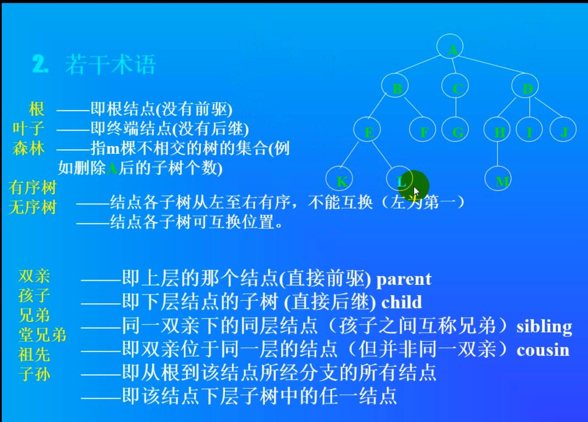

### 树与二叉树

名词解释

  

- 二叉树的插入分左右！！！！！
- 未完成

```
#include <iostream>


using namespace std;


class Node {
public:
	int data;
	Node* left = nullptr;
	Node* right = nullptr;
	
};

class tree {
public:

	Node* Head = nullptr;
	size_t size;

	Node* tmp = Head;
	Node* seek_left_last()
	{
		if (tmp->left != nullptr && tmp != nullptr)
		{
			seek_left_last();
			tmp = tmp->left;
		}
		else
		{
			return tmp;
		}
	}

	Node* seek_right_last()
	{
		if (tmp != nullptr && tmp->right != nullptr)
		{
			seek_right_last();
			tmp = tmp->right;
		}
		else
		{
			return tmp;
		}
	}
	  //先序遍历，D-L-R
	void DLRShow(Node* t) {

		if (t == nullptr)
			return;

		cout << t->data <<"\t" <<endl;
		DLRShow(t->left);
		DLRShow(t->right);

	}

	//中序遍历 L-D-R
	void LDRShow(Node* t) {

		if (t == nullptr)
			return;

		DLRShow(t->left);
		cout << t->data << "\t" << endl;  		
		DLRShow(t->right);

	}

	void LDRShow1()
	{
		LDRShow(Head);
	}

	//后序遍历 L-R-D
	void LRDShow(Node* t) {

		if (t == nullptr)
			return;

		DLRShow(t->left);		
		DLRShow(t->right);
		cout << t->data << "\t" << endl;

	}

	void insert(int a)	  
	{
		/*static int times = 0;*/

		if (Head == nullptr)
		{
			Node* x = new Node;
			x->data = a;
			Head = x;
			++size;
			cout << "Head join \t" <<a<< endl;
			return ;
		}
		else
		{

			Node* tt = this->Head;
			insert_b(a,tt);

		}
	}


	void insert_b(int a,Node* tmp1)
	{
		
		if (tmp1==nullptr )
		{ 
			return;
		}
		if (tmp1->left == nullptr && tmp1->data > a)
		{
			Node* x = new Node;
			x->data = a;
			tmp1->left = x;
			++size;
			cout << "left join \t" << a << endl;
			
			return;
			
		}
		else
		{
			insert_b(a, tmp1->left);
		}


		if (tmp1->right == nullptr && tmp1->data < a)
		{
			Node* x = new Node;
			x->data = a;
			tmp1->right = x;
			++size;
			cout << "right join \t" << a << endl;
			return;
		}
		else
		{
			insert_b(a, tmp1->right);
		}


		//if (tmp1->right == nullptr && tmp1->data == a)
		//{
		//	Node* x = new Node;
		//	x->data = a;
		//	tmp1->right = x;
		//	++size;
		//	cout << "right join \t" << a << endl;
		//	return;
		//}


	}
};


int main(void)
{
	srand(time_t(0));
	tree* tree1 = new tree;
	for (size_t i = 0; i < 10; i++)
	{
		size_t nnn = rand();
		tree1->insert(nnn);

	}

	tree1->LDRShow1();


	cout << endl << "size =\t" << tree1->size << endl;
	cin.get();
	cin.get();
	return 0;

}
```