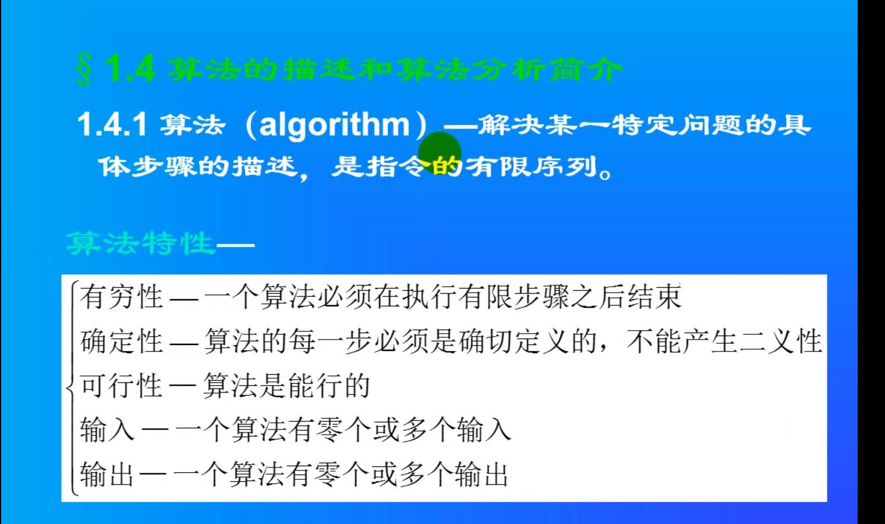
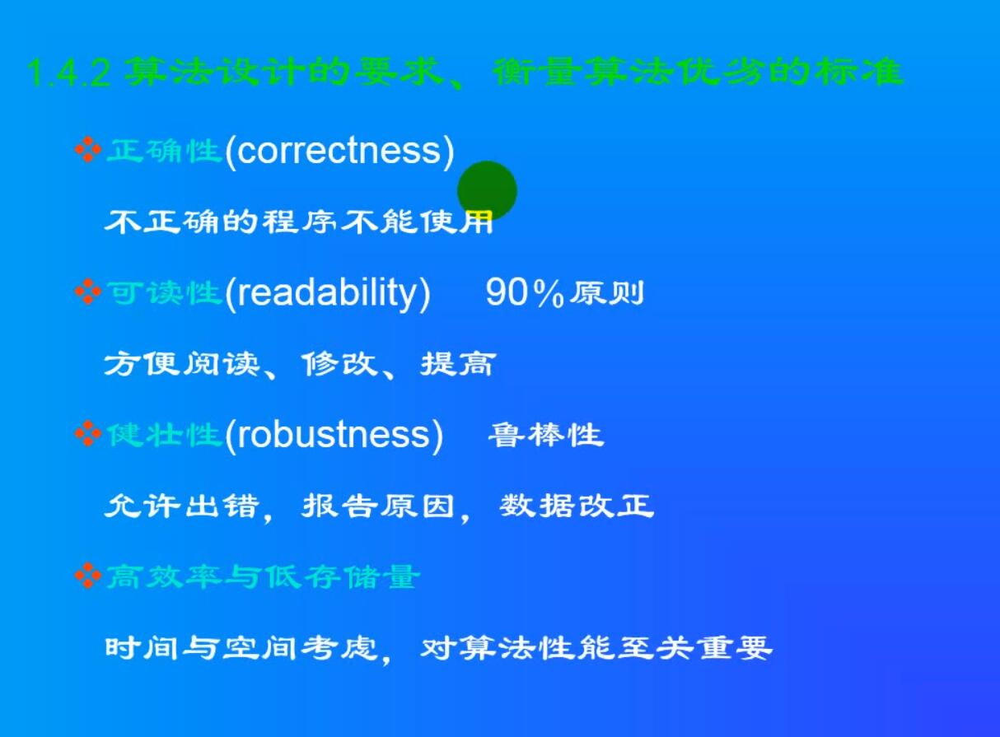

### 设计模式

#### 备忘录模式

- 在一个类内部记录另一个类的快照状态的模式。可以再合适的时候跳回复用

- 设计备忘录的三大步骤：
1. 设计记录的节点，存储记录
2.设计记录的存储： vector list map set 可以使 链表 图 数组 树
3.操作记录的类，记录节点状态，设置节点状态，显示节点状态

#### 策略模式

- 策略模式针对一组算法，将每一个算法封装到具有共同接口的独立类中。

- 从而使得他们可以相互转换，策略模式可以在不影响客户端的情况下使算法发生改变。策略模式把行为和环境分离开来，环境类负责维持和查询行为类。

- 策略模式依赖多态，策略模式的抽象类，接口，抽象类的指针可以访问所有子类对象（纯虚函数）
- 各种策略的实现类。都必须集成抽象类。
- 策略的设置接口类。设置不同的策略
=======
### 设计模式 抽象工厂模式
- 工厂模式： 客户类和工厂类分开。
- 消费者需要任何产品，只需要和工厂请求就可以了。
- 消费者无需修改就可以接纳新产品，缺点是当产品修改时，工厂类也要做相应的修改

=======
### 设计模式


#### 简单工厂模式
- 基类存放数据 派生类存放操作
- 再实现一个调用各个操作的静态类，调用时返回派生类指针

代码： [simple_factory](simple_factory.cpp)


####  方法工厂模式

- 把操作和实例化工厂的类分别抽象出来
- 通过继承抽象类实现不同的操作
- 方法工厂模式就是简单工厂模式把工厂进行抽象并且进行封装后得到的

代码： [factory_method](factory_method.cpp)

``` 不能在linux 下编译！！！ 报错 only nonstatic member functions may be virtual
 ```

#### 抽象工厂模式
- 工厂模式： 客户类和工厂类分开。
- 消费者需要任何产品，只需要和工厂请求就可以了。
- 消费者无需修改就可以接纳新产品，缺点是当产品修改时，工厂类也要做相应的修改
- 消费者 工厂 商品都有自己的抽象类并且通过继承 实例化 抽象接口 ，提供不同的服务

<!-- 2.wmv 56.28 -->

#### 单例模式

- 单例模式确认某个类只有只有一个实例
- 有两种实现模式： 1.匿名类的声明 &nbsp; 2.通过内部的静态类指针来实现
- 单例模式：单例模式确保某一个类只有一个实例，
- 而且自行实例化并向整个系统提供这个实例单例模式
- 单例模式只应在有真正的“单一实例”的需求时才可使用。

```class {
    public:
    int a=100;
    }aa;
```

[示例](SingleInstance.cpp)

#### 代理模式

- 代理模式：代理模式给某一个对象提供一个代理对象，
- 并由代理对象控制对源对象的引用。
- 代理就是一个人或一个机构代表另一个人或者一个机构采取行动。
- 某些情况下，客户不想或者不能够直接引用一个对象，
- 代理对象可以在客户和目标对象直接起到中介的作用。
- 客户端分辨不出代理主题对象与真实主题对象。
- 代理模式可以并不知道真正的被代理对象，
- 而仅仅持有一个被代理对象的接口，这时候代理对象不能够创建被代理对象，
- 被代理对象必须有系统的其他角色代为创建并传入。

[代理模式示例](proxy.cpp)


#### 迭代器模式

- 迭代子模式：迭代子模式可以顺序访问一个聚集中的元素而不必暴露聚集的内部表象。
- 多个对象聚在一起形成的总体称之为聚集，聚集对象是能够包容一组对象的容器对象。

#### 命令行模式

- 把执行命令单独建一个类。专职做命令的执行工作
- 命令的执行者专么建一个基类，存放执行不同命令的类继承自这个基类。通过执行不同命令划分。
- 再建一个类统筹这些执行命令的类，调用执行命令的类。

- 代码：
[命令模式示例代码](Command_mode.cpp)


#### 责任链模式：

- 一级传达另一级，知道没有上级，直到最高级
- [责任链模式示例](duty_mode.cpp)


>>>>>>> a04d818ed1530b3d0e6287cdc07815c5664fb049

### 20140903数据结构与算法 

#### 总览


#### 概论 


#### 算法的特性


#### 算法的衡量标准


### Boost和算法

#### boost Array 第一只boost 程序

-  使用boost 必须下载安装适当的编译好的包。
- 各个VS 使用的版本不一样
- Linux只能自己编译
- boost 的命名空间为boost

[boost第一个程序（array)](boost_CPP.cpp)

#### boost 库的学习 boost_array_bind_fun_ref

##### std 方式

- 绑定已有函数增加新的参数但是不改变原来的函数(std 方式)
- 使用：
  - 1执行操作的类继承自 std::binary_function<>
  - 2.使用bind1st()
- 代码：
  - [bind1st示例代码](bind1st.cpp)

##### boost方式

- [boost::bind示例代码](boostbind.cpp)
- [boost详解](boostbind.md)

#### boost::function 库

- boost::function 库提供了一个类模板 boost::function。它是一个仿函数类，用于封装各种函数指针通常用来和bind结合起来使用。当仿函数没有绑定任何指针时，会抛出 boost::bad_function_call异常。

#### boost::ref

- 不能拷贝对象用boost::ref()


#### RAII 
- 避免内存泄漏，把堆上的内存当做栈使用

#### 智能指针 smartpointers 库


###  类的虚函数表
- 类有一个虚函数表，存储着所有虚函数的地址。
- 类总是把虚函数表放在最前面
- 一种访问类的虚函数的方法（代码如下：）
- 不管基类中是公有，私有，都不影响子类集成虚函数
- 虚函数顺序：基类-》子类
- 多重继承子类会有多个虚函数表，每个虚函数表继承自每个基类的虚函数表

```
#include <iostream>

using namespace std;

class A
{
public:


	void virtual a() {
	
		std::cout << "A --> a" << endl;
	}

	void virtual b() {

		std::cout << "A--> b" << endl;
	}

	void virtual c() {

		std::cout << "A--> c" << endl;
	}
private:

};


class B :public A
{
public:
	void virtual a()
	{
		std::cout << "B--> a" << endl;
	}

	void virtual b() {

		std::cout << "B--> b" << endl;
	}
};


typedef  void (*Pfunc) (void);

int main(void)
{
	B b;
	cout << "B is " <<sizeof(b) << endl;
	
	Pfunc pfc;
	for (int i = 0; i < 3; i++)
	{

		/*	  (&b) 取出B的地址 
			(int *)(&b) 转换b的地址为int 类型，方便后期访问紧跟着它的内存
			*(int *)(&b)   取出B里面的内容（虚函数表的地址）
			(int *) *(int *)(&b) 把虚函数表的地址转换为int类型，方便后期访问紧跟着它的内存
			(int *) *(int *)(&b) + i  利用地址存储的机制，+1 自动跳过4（8）个字节，访问下一个内存内容，访问存储在虚函数表里面的函数地址
			(Pfunc)*   将虚函数表李的函数指针地址转换为 pFunc 类型的函数指针地址，方便调用
					  pfc(); 调用
			

		*/
		pfc = (Pfunc)*((int *) *(int *)(&b) + i);
		pfc();
	}


	cin.get();

	return 0;
}

```

