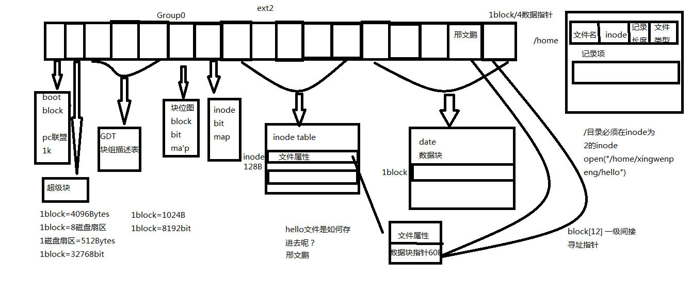

# Linux 编程

## Linux 为文件

### PCB 概念
- 

### 函数

- open 函数
    - 查看 manpage `man open 2`
```

```

- write

- read 

- close

- strlen() 和 sizeof()
    - strlen 只计算有字符串的大小
    - sizeof() 会计算整个数组的大小


- ulimit -a 查看最多打开文件个数


### 阻塞和非阻塞
- 使用Linux 函数  阻塞输入和输出
```
#include <stdlib.h>
#include <sys/types.h>
#include <sys/stat.h>
#include <unistd.h>
#include <string.h>


int main (int argc,char** argv)

{
  char buf[1024]={0};
  
   read(STDIN_FILENO,buf,sizeof(buf));

   write(STDOUT_FILENO,buf,strlen(buf));


   return 0;

}
 ```

- /dev/tty 指向 本终端 O_NONBLOK 标志，非阻塞标志

- perror 函数： 打印错误

- lseek () 函数
    - 移动位置指针
    - man lseek

- fcntl()
    - 获取/重设文件访问权限

### 文件系统


- stat 查看文件信息

- 一个目录是4096 Bytes 大小。 是一个块

- / 目录inode为2 

- link 函数 创建硬链接