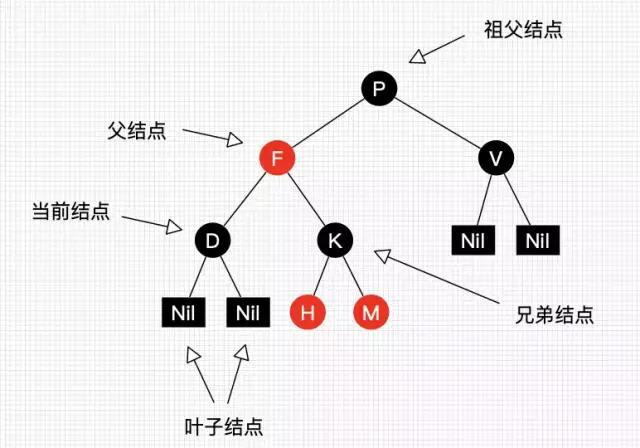
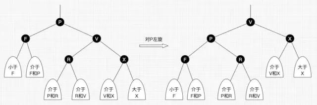
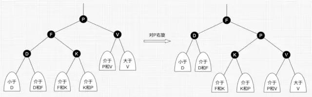
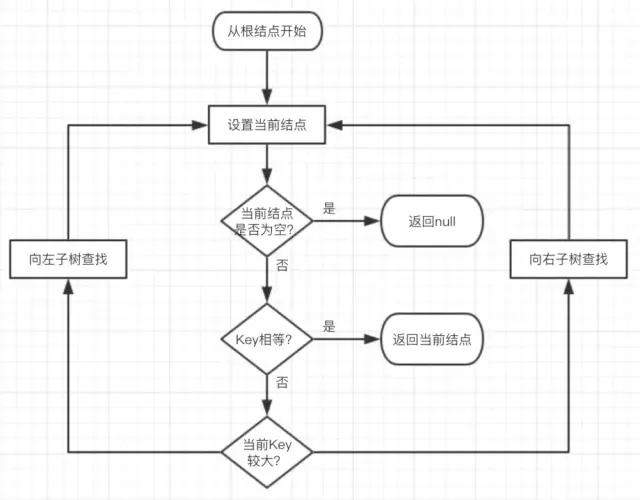
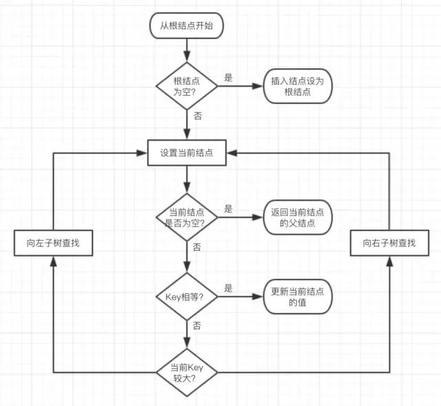
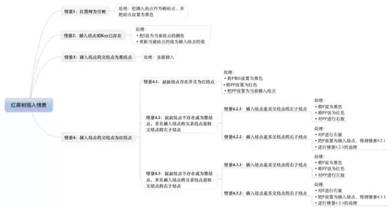

# 红黑树

<!-- TOC -->

- [红黑树](#红黑树)
    - [定义](#定义)
    - [一般叫法](#一般叫法)
    - [性质](#性质)
        - [红黑树的特性:](#红黑树的特性)
    - [实现](#实现)
        - [RBTnode](#rbtnode)
        - [旋转（左旋和右旋）](#旋转左旋和右旋)
            - [左旋：](#左旋)
            - [右旋：](#右旋)
            - [变色：](#变色)
        - [查找](#查找)
        - [插入](#插入)
            - [查找插入的父结点很简单，跟查找操作区别不大：](#查找插入的父结点很简单跟查找操作区别不大)

<!-- /TOC -->

## 定义

- 红黑树(Red-Black Tree，简称R-B Tree)，它一种特殊的二叉查找树。
红黑树是特殊的二叉查找树，意味着它满足二叉查找树的特征：任意一个节点所包含的键值，大于等于左孩子的键值，小于等于右孩子的键值。
除了具备该特性之外，红黑树还包括许多额外的信息。
红黑树的每个节点上都有存储位表示节点的颜色，颜色是红(Red)或黑(Black)。

## 一般叫法

- 我们把正在处理(遍历)的结点叫做当前结点，如图 2 中的 D，它的父亲叫做父结点，它的父亲的另外一个子结点叫做兄弟结点，父亲的父亲叫做祖父结点。

## 性质

### 红黑树的特性:
- (1) 每个节点或者是黑色，或者是红色。
- (2) 根节点是黑色。
- (3) 每个叶子节点是黑色。 [注意：这里叶子节点，是指为空的叶子节点！]
- (4) 如果一个节点是红色的，则它的子节点必须是黑色的。
- (5) 从一个节点到该节点的子孙节点的所有路径上包含相同数目的黑节点。

关于它的特性，需要注意的是：
第一，特性(3)中的叶子节点，是只为空(NIL或null)的节点。
第二，特性(5)，确保没有一条路径会比其他路径长出俩倍。因而，红黑树是相对是接近平衡的二叉树。

## 实现

### RBTnode

### 旋转（左旋和右旋）

- 红黑树也是二叉查找树，我们知道，二叉查找树这一数据结构并不难，而红黑树之所以难是难在它是自平衡的二叉查找树，在进行插入和删除等可能会破坏树的平衡的操作时，需要重新自处理达到平衡状态。
-  左子树和右子树的黑结点的层数是相等的，也即任意一个结点到到每个叶子结点的路径都包含数量相同的黑结点(性质 5)。所以我们叫红黑树这种平衡为黑色完美平衡。

#### 左旋：
- 以某个结点作为支点(旋转结点)，其右子结点变为旋转结点的父结点，右子结点的左子结点变为旋转结点的右子结点，左子结点保持不变。如图 :

#### 右旋：
- 以某个结点作为支点(旋转结点)，其左子结点变为旋转结点的父结点，左子结点的右子结点变为旋转结点的左子结点，右子结点保持不变。如图:
]

#### 变色：
  - 结点的颜色由红变黑或由黑变红。

### 查找
- 因为红黑树是一颗二叉平衡树，并且查找不会破坏树的平衡，所以查找跟二叉平衡树的查找无异：

    - 从根结点开始查找，把根结点设置为当前结点。
    - 若当前结点为空，返回 null。
    - 若当前结点不为空，用当前结点的 key 跟查找 key 作比较。
    - 若当前结点 key 等于查找 key，那么该 key 就是查找目标，返回当前结点。
    - 若当前结点 key 大于查找 key，把当前结点的左子结点设置为当前结点，重复步骤 2。
    - 若当前结点 key 小于查找 key，把当前结点的右子结点设置为当前结点，重复步骤 2。
- 如图所示：
  

- 非常简单，但简单不代表它效率不好。正由于红黑树总保持黑色完美平衡，所以它的查找最坏时间复杂度为 O(2lgN)，也即整颗树刚好红黑相隔的时候。      

### 插入
- 插入操作包括两部分工作：一是查找插入的位置;二是插入后自平衡。

#### 查找插入的父结点很简单，跟查找操作区别不大：

- 从根结点开始查找。
- 若根结点为空，那么插入结点作为根结点，结束。
- 若根结点不为空，那么把根结点作为当前结点。
- 若当前结点为 null，返回当前结点的父结点，结束。
- 若当前结点 key 等于查找 key，那么该 key 所在结点就是插入结点，更新结点的值，结束。
- 若当前结点 key 大于查找 key，把当前结点的左子结点设置为当前结点，重复步骤 4。
- 若当前结点 key 小于查找 key，把当前结点的右子结点设置为当前结点，重复步骤 4。
-如图所示：

OK，插入位置已经找到，把插入结点放到正确的位置就可以啦，但插入结点应该是什么颜色呢?

答案是红色。理由很简单，红色在父结点(如果存在)为黑色结点时，红黑树的黑色平衡没被破坏，不需要做自平衡操作。

但如果插入结点是黑色，那么插入位置所在的子树黑色结点总是多 1，必须做自平衡。

所有插入情景如图所示：
