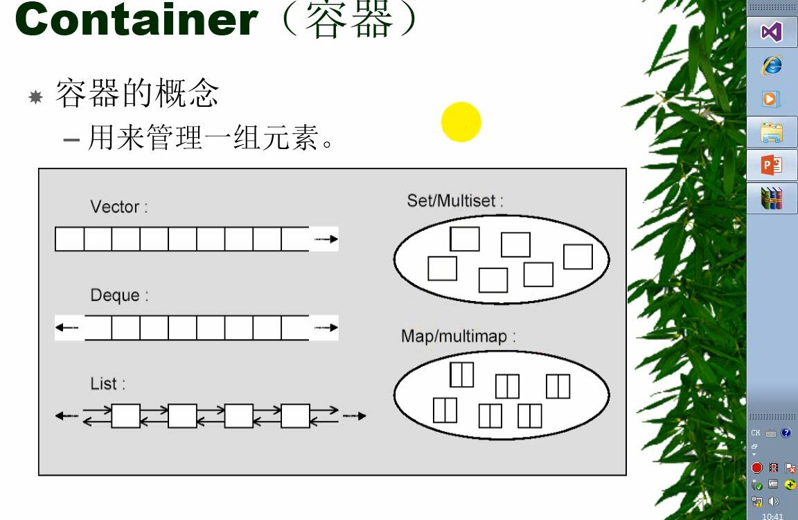
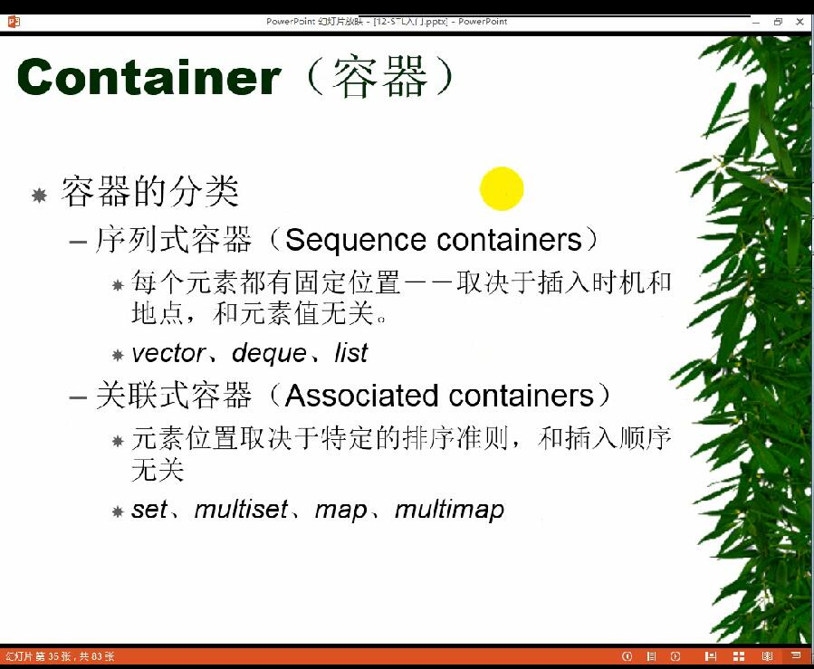
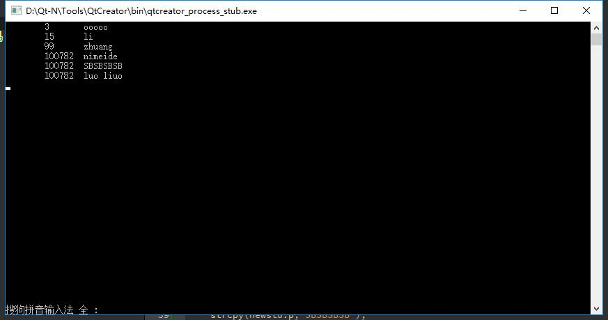
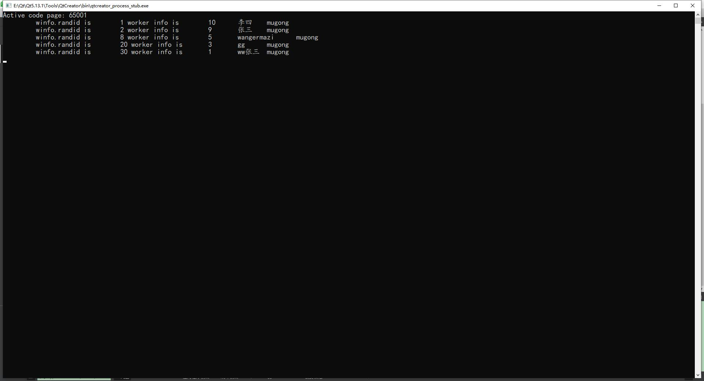

# CPP 学习笔记
## 多线程
### 文件操作已经学完，今天看下多线程  2019.11.11 15:06
#### 知识点１
<li> Linux 下编译 带&ltthread&gt 的CPP需要加上 -pthread 编译选项。例如：
```
g++ -std=c++11 -pthread a.cpp

```
<li>QT Creator 编译带&ltthread&gt的CPP有ＢＵＧ，暂时不知道怎么去除！

####  代码1

```#include <iostream>
#include <stdlib.h>v
#include <thread>

using namespace std;
void run(char* p)
{
    int i=0;
    i=system(p);
}

int main()
{
    char p[5][20]={
        "ls",
        "echo nihao",
        "gnome-terminal",
        "terminator",
        "ps -aux"

    };

    while("nimei")
    {
       static  int i(0);
        if(i<5){
            thread  *pt=new  thread(run,p[i]);
            i+=1;
            cout<<"I now is :\t"<<i<<endl;
        }
        else{
            break;
        }

        cout<<"Breaking...."<<endl;
    }


    cin.get();
    return 0;
}
```
#### 知识点２

<li> 关于thread类的内部成

| 关键字                       | 详细解释                                             |
| ---------------------------- | ---------------------------------------------------- |
| id                           | Thread的iｄ                                          |
| native_handle_type           | native_handle_type                                   |
| operator=                    | Move massive Thread                                  |
| get_id                       | get Thread ID                                        |
| joinable                     | get if joinable                                      |
| join                         | join thread                                          |
| detach                       | detach thread                                        |
| swap                         | swap thread                                          |
| native_handle                | get native handle                                    |
| hardware_concurrency[static] | Detect hardware concurrency (public static function) |


<li> 线程 detach 脱离主线程的绑定，主线程挂了，子线程不报错，子线程执行完自动退出。

<li> 线程 detach以后，子线程会成为孤儿线程，线程之间将无法通信。

### 知识点３

<li>线程中变量的竞争控制是通过 mutex automic 来实现的

<li>mutex : 互斥量。需要包含头文件　&ltmutex> 来使用　-->速度慢

<li>atomic 原子变量。需要包含头文件&ltatomic>来实现　-->速度快，线程安全。

#### 代码３

```
#include <iostream>
#include <stdlib.h>
#include <thread>
#include <atomic>

using namespace std;
int count(0);

void run()
{
    for(int i(0);i<1000000;i++)
    {
        count++;
        cout<<"\t"<<i<<"\t"<<count<<"\t";
    }
}

int main()
{
    auto n=thread::hardware_concurrency();

    thread* pt[n];
    for(int z=0;z<n;z++)
    {
        pt[z]=new thread(run);
        pt[z]->detach();

    }

    cout<<"Finally count is \t"<<count<<endl;
    cout<<"Used "<<n <<"threads"<<endl;


    cin.get();
    return 0;
}
```

<em>运行结果不是1000000×２．

```#include <iostream>
#include <stdlib.h>
#include <thread>
#include <atomic>

using namespace std;
int count(0);

void run()
{
    for(int i(0);i<1000000;i++)
    {
        count++;
        cout<<"\t"<<i<<"\t"<<count<<"\t";
    }
}

int main()
{
    auto n=thread::hardware_concurrency();

    thread* pt[n];
    for(int z=0;z<n;z++)
    {
        pt[z]=new thread(run);
        pt[z]->detach();

    }

    cout<<"Finally count is \t"<<count<<endl;
    cout<<"Used "<<n <<"threads"<<endl;


    cin.get();
    return 0;
}
```
<em>运行结果是1000000×２．正确

<li><em>atomic 声明方式为　atomic&ltint> a(100); 等号初始化会报错

<li><em>vim 按ＣＴＲＬ+S 后假死按　ＣＴＲＬ＋q 退出

## STL
### STL 学习，没有带笔记本回来。。。我日 2019.11.11 23:21

#### STL的概念

<li> Iterator  (迭代器)
<li> Container (容器) array
<li> Alogrithm (算法)
<li> Adapters (配接器) 用来实现容器之间的转接<br>
 面向过程--》面向对象-》基于对象-》泛型

#### 代码

```
#include <iostream>
#include <vector> //容器
#include <algorithm> //算法

using namespace std;

//专么实现一个类模板，实现打印
//类模板实现了方法
template <class T>
class vector_s {
public:
void operator()(const T &t1) //重载了小括号 实现访问小括号就直接打印
	{
		cout << t1 << endl;
	}
};

int main(void)
{
	vector<int> myv;
	myv.push_back(13);
	myv.push_back(23);
	myv.push_back(33);
	myv.push_back(113);
	myv.push_back(1995);
	myv.push_back(1996);

	vector_s<int> print; // 对打印实现实例化

    //myv.begin(), myv.end() 是迭代器 本质是指针
    // for_each 本质是一个算法
	for_each(myv.begin(), myv.end(), print);

	cin.get();


	return 0;
}
```

<br>
<li>注意：算法需要包含头文件 &ltalgorithm&gt <br>
<li>这个遍历的函数为 for_each 不是foreach<br>
<li>算法可以适用于任何容器<br>

#### STL抽象的是什么

-有些算法并不依赖于数据结构的特定实现，而只依赖于该结构的几个基本语义属性

-STL 抽象出的这些基本属性（concept）成功的将算法和数据结构相分离，在没有效率损失的前提下，获得了极大的弹性！

### 六大组件

-容器 （container)

-算法Algorithm

-迭代器 （iterator）

-仿函数 （Function Object)

-适配器 （Adaptor）

-空间制配器 （allocator)


获取远程代码修改后,想要push到远端与原来不同的新分支，可以使用下面的命令实现：
git push origin 本地分支:远端希望创建的分支


例如git下来的分支为master

git branch master
git push origin master:my_remote_new_branch
#远端即可创建新的分支my_remote_new_branch,提交本地修改

### 2019.11.13 9:32

``` std::for_each(arr.begin(), arr.end(), func);```

 比较有用的for_each 用法

 ```for (auto n:Original)```

 C++ 11 新的for

### 2019.11.03 23:46

#### typename
- 成员函数也可以是模板-
- typename 作为类型前的标识符号-


 ```template <class T>
class MyClass
        typename T::SubType *  ptr; //typename 直接指示 T::SubType * 为一个类型 没有typename 会被解析为
            // T域中的 SubType 静态成员 乘于（*） ptr.
        ...
        };
 ```


-typename 的第二个作用：在模板声明中替换class -

  ```template <typename T > class Myclass;```


####  static_cast 只有当类型转换有所定义，转换才会成功。（明确转换类型）
####  dynamic_cast 将多态类型向下转换\<downcast> 被转换的类必须有虚函数。否则失败
####  const_cast 用于转换为const 值
####  reinterpret_cast 多用于指针个的转换
####  C语言的小括号（）可以替换除dymanic_cast 外的所有静态转换函数，无法明确显示使用他们的切确理由

### 容器的概念
-用于管理一组元素


#### 容器的分类
##### -序列式容器\(Sequence containers)
-每个元素都有固定位置--去结余插入时机和地点，和元素值无关
-vector list  deque
##### 关联式容器 \(Associated containers)
-元素取决于特定的排序准则，和插入顺序无关
-set multiset map multimap



#### array
``` array <int ,5>={1,2,3,4,5};```
-静态数组，栈上
#### vector 动态数组 堆上
  ```vector <int> mv;
   mv.push_back()
   ```
   -不需要变长，容量较小，array 需要变长，容量较大，用vector

#### tuple 可以存储不同的数据类型

#### list 适合经常插入，经常删除的情况


#### list 容器

-list容器是无序容器

-list 容器只能通过迭代器访问。通过++ -- 遍历

-list容器可以使用remove（）方法删除元素，

-可以同时正向和反向查找

-可以使用sort()函数排序

-可以使用merge 合并，但是合并之前必须排序

-可以使用unique()函数删除重复项，删除前必须排序。

--merge (使)合并，结合，并入;相融;融入;渐渐消失在某物中

#### set 容器 （红黑树容器）

-set容器不能有重复项，重复的会被舍弃
-set容器会自动排序
-set 用insert插入元素
-set可以用find（）函数查找位置

循环加栈


### algorithm 算法

find（）函数可以查找数组、容器中的元素。

for_each(); 遍历每一个元素。

multiset和set差不多，但是允许重复元素。

迭代器本质是智能指针。

### Iterator

#### 仿函数

```auto ifind=find_if(mylist.bengin(),mylisy.end(),bindlst(greater<int>(),3));```

bindlst 需要头文件 funtional   ```#include <functional>```

```bindlst(greater<int>(),3);```  绑定一个函数。 ```greater<int>() ```  是一个仿函数（functional)  是一个重载了（）的类/结构 体 ，可以用来实现一定的算法策略。

仿函数例子：
``` #include <iostream>
#include <list>
#include <functional>
#include <array>
#include <algorithm>

using namespace std;


class shuchu {
  public:

  void operator()(int x)
  {
    std::cout<<x<<endl;
  }
};


 int main(int argc, char const *argv[]) {
  /* code */

  // array<int,5>array1({1,2,3,4,5});
  list <int>ls1;
  ls1.push_back(1);
   ls1.push_back(3);
    ls1.push_back(5);
     ls1.push_back(7);
      ls1.push_back(9);
  auto ib=ls1.begin();
  auto ie=ls1.end();
  for_each(ib,ie,shuchu());
  cin.get();
  return 0;
}

```

### 2019.11.15  6.wmv STL Bug 迭代器

-智能指针有一个_Ptr属性，可以打印里面的指针。

-STL 有bug 先访问迭代器的_Ptr属性，再访问迭代器指针正常，但是反过来会出错。

-分行打印就没有问题。


### 2019.11.15  7.wmv 栈队列双端队列优先队列

#### stack 关键字可以构建栈

-用法

```stack <mystack>;  //声明一个栈```
```mystack.push(num); //压栈```
```mystack.pop(); //出栈```
```mystack.top(); //获取第一个元素```


stack成员函数示例
-size( ) :返回栈中元素个数
-top( ) :返回栈顶的元素
-pop( ) :从栈中取出并删除元素
-push(e) :向栈中添加元素e
-empty( ) :栈为空时返回true


#### queue  队列

-queue 英 [kjuː]   美 [kjuː]  

n.(人、汽车等的)队，行列;(储存的数据)队列
v.(人、车等)排队等候;(使)排队;列队等待

-queue 需要头文件 \<queue>

-从网上拔来的Queue

[queue详解](queue.md)

<h2>queue 操作</h2>
queue 和 stack 有一些成员函数相似，但在一些情况下，工作方式有些不同：<br>
<ul>
<li>
front()：返回 queue 中第一个元素的引用。如果 queue 是常量，就返回一个常引用；如果 queue 为空，返回值是未定义的。</li>
<li>
back()：返回 queue 中最后一个元素的引用。如果 queue 是常量，就返回一个常引用；如果 queue 为空，返回值是未定义的。</li>
<li>
push(const T&amp; obj)：在 queue 的尾部添加一个元素的副本。这是通过调用底层容器的成员函数 push_back() 来完成的。</li>
<li>
push(T&amp;&amp; obj)：以移动的方式在 queue 的尾部添加元素。这是通过调用底层容器的具有右值引用参数的成员函数 push_back() 来完成的。</li>
<li>
pop()：删除 queue 中的第一个元素。</li>
<li>
size()：返回 queue 中元素的个数。</li>
<li>
empty()：如果 queue 中没有元素的话，返回 true。</li>
<li>
emplace()：用传给 emplace() 的参数调用 T 的构造函数，在 queue 的尾部生成对象。</li>
<li>
swap(queue&lt;T&gt; &amp;other_q)：将当前 queue 中的元素和参数 queue 中的元素交换。它们需要包含相同类型的元素。也可以调用全局函数模板&nbsp;swap() 来完成同样的操作。</li>
</ul>
<br>
queue&lt;T&gt; 模板定义了拷贝和移动版的 operator=()，对于所保存元素类型相同的 queue 对象，它们有一整套的比较运算符，这些运算符的工作方式和 stack 容器相同。<br>

#### deque 双端队列

- deque 可以从头部push_front()和尾部push_back()插入 
- deque 可以使用迭代器 可以使用 迭代器+n 访问删除
- deque 可以pop_front() pop_back() 从头部和尾部 删除元素。

(1)    构造函数

deque():创建一个空deque

deque(int nSize):创建一个deque,元素个数为nSize

deque(int nSize,const T& t):创建一个deque,元素个数为nSize,且值均为t

deque(const deque &):复制构造函数

(2)    增加函数

void push_front(const T& x):双端队列头部增加一个元素X

void push_back(const T& x):双端队列尾部增加一个元素x

iterator insert(iterator it,const T& x):双端队列中某一元素前增加一个元素x

void insert(iterator it,int n,const T& x):双端队列中某一元素前增加n个相同的元素x

void insert(iterator it,const_iterator first,const_iteratorlast):双端队列中某一元素前插入另一个相同类型向量的[forst,last)间的数据

(3)    删除函数

Iterator erase(iterator it):删除双端队列中的某一个元素

Iterator erase(iterator first,iterator last):删除双端队列中[first,last）中的元素

void pop_front():删除双端队列中最前一个元素

void pop_back():删除双端队列中最后一个元素

void clear():清空双端队列中最后一个元素

(4)    遍历函数

reference at(int pos):返回pos位置元素的引用

reference front():返回手元素的引用

reference back():返回尾元素的引用

iterator begin():返回向量头指针，指向第一个元素

iterator end():返回指向向量中最后一个元素下一个元素的指针（不包含在向量中）

reverse_iterator rbegin():反向迭代器，指向最后一个元素

reverse_iterator rend():反向迭代器，指向第一个元素的前一个元素

(5)    判断函数

bool empty() const:向量是否为空，若true,则向量中无元素

(6)    大小函数

Int size() const:返回向量中元素的个数

int max_size() const:返回最大可允许的双端对了元素数量值

(7)    其他函数

void swap(deque&):交换两个同类型向量的数据

void assign(int n,const T& x):向量中第n个元素的值设置为x
 
[deque网上扒来的](deque.md)

#### priority_que 优先级队列 （不太理解）

- 优先队列是按照堆来实现的

### 红黑树容器

#### set 是一个红黑树


### set map multi-map 红黑树

#### set的高级用法
- 红黑树，处理纯字符串比较少，处理字符串及对象比较多。
- pair 复合集合
- 二叉树查找依赖于有序。 字符串可以实现有序。
- pair 也是个类模板！起到获取插入返回值（boolean)的作用。两个参数，第一个类型，第二个是比大小的方法
- set的每一个节点就是一个节点
- 二叉树的实现语法一直在在在变 。VS2013 能过的 VS2017 就不能过了！~！！mingw 32又能过，代码如下：
- set 不能包含同样的值
-  0-35:40
```#include <iostream>
#include <set>
#include <string>
#include <stdio.h>
#include <string.h>

using namespace std;

class strless
{
public:

    bool operator () (const char* p,const char* p1)
    {
        return strcmp(p, p1) < 0;
    }

private:

};


int main(void)
{
    const char* cmd[] = { "nihao","spectrc","calc","good" };
    set<const char *, strless>myset(cmd,cmd+4,strless());
    auto ib = myset.begin();
    auto ie = myset.end();

    for (auto i : myset)
    {
        cout << i << endl;
    }


    return 0;

}
```
#### multiset
- 可以插入相同的值
- multiset 的每一个节点是一个链表
- 练习代码如下（mingw 32编译）：
```#include <iostream>
#include <set>
#include <string.h>

using namespace std;

class stu{
public:
    int id;
    char p[100];
};

class stuless
{
public:

    bool operator ()(const stu &st1,const stu &st2)
    {
        return st1.id<st2.id;
    }

};


int main()
{
    stu student[3]={
        {99,"zhuang"},
        {15,"li"},
        {3,"ooooo"}
    };

    stu newstu;
    newstu.id=100782;
    strcpy(newstu.p,"nimeide");
    multiset<stu,stuless> stu1 (student,student+3,stuless());
    stu1.insert(newstu);
    strcpy(newstu.p,"SBSBSBSB");
    stu1.insert(newstu);
     strcpy(newstu.p,"luo liuo");
    stu1.insert(newstu);

    for(auto i:stu1)
    {
        cout<< "\t"<<i.id<<"\t"<<i.p<<endl;
    }

    return 0;

}
```

- 输出

- 



#### map  映射 multimap 多层映射 &nbsp;9.wmv 53:41

- map 也是 红黑树，但是能同时映射多个数据
- map 需要头文件 \<map>
- 映射都是左边映射到右边。访问时用右边访问左边。可以通过对等的映射查找
- 示例代码如下：

```#include <iostream>
#include <string>
#include <map>
#include <stdlib.h>

using namespace std;

class worker{

public:
    int id;
    string name;
    string work;
};


class winfo{
public:
    int randid;
     worker w1;

};


int main()
{
    system("chcp 65001");

    winfo warr[]={

        {1,{10,"李四","mugong"}},
         {2,{9,"张三","mugong"}},
         {8,{5,"wangermazi","mugong"}},
         {20,{3,"gg","mugong"}},
         {30,{1,"ww张三","mugong"}}
    };

    map <int,worker> m;
    for(auto i : warr)
    {
        static int n=0;
        m[warr[n].randid]=warr[n].w1;
        n++;
    }

    auto ib=m.begin();
    auto ie=m.end();

    for(;ib!=ie;ib++)
    {
        cout<<"\t winfo.randid is \t"<<(*ib).first<<" worker info is \t"<<(*ib).second.id<<"\t"<<(*ib).second.name
           <<"\t"<<(*ib).second.work<<"\t"<<endl;
    }

    return 0;
}
```

- 输出
  
  


#### pair 关键字 &nbsp;9.wmv 01:23:15 

- 用于插入 复杂映射类型
- multimap set map 每一个节点就是一个 pair
- 用法：
  
```multimap <const char*,int>m;
m.insert(pair<const char*,int> ("第一个"),1);
m.insert(pair<const char*,int> ("第二个"),2);
m.insert(pair<const char*,int> ("第三个"),5);
m.insert(pair<const char*,int> ("第四个"),8);

```
#### hash_set 和hash_map &nbsp;9.wmv 01:33:10

- 作用：把比较大的数据抽象得比较小
- hash_set 不会自动排序 查找时一次就足够了。而set需要 log2n 次
- 适用于精确查找，一次就能找到。比二分查找要快
- hash_set 的经典用法 判断数据是否相等
- hash_set、hash_map 不会自动排序 
- hash算法依赖于hash_table

#### equal_range()
- 找到红黑树的链表节点，遍历所有节点
- first为链表的首节点，second 为最后一个空节点

### string 本质是一个容器

- C语言中 下列代码是错误的：
``` 
char str[54];
str="123456";
```

- erase() 函数可删除字符串。 str1.erase(3,4); erase(str1.begin(),str.begin()+2);

- replace() 替换函数 str1.replace(3,3,"China");str1.replace(3,"China");
str1.replace(3,"China"); replace (位置，长度，字符串)；
- str.find() 查找字符串，找到第一个匹配的字符的位置，找不到返回-1；
- rfind（） 反向查找，返回找的的第一个的匹配的字符串的位置。找不到返回-1；

- find_first_of () 找到第一个并返回所在位置。

- find_first_not_of () 找到第一个不匹配的并返回所在位置。

- find_last_of () 找到最后一个匹配的并返回所在位置。

- find_last_not_of () 找到最后一个不匹配的并返回所在位置。

##### 网上扒来的 string 介绍

- [String](string.md)


### GPU编程 

- 可以利用模板类实现对容器的操作（利用重载括号的方式）

#### Lamda 表达式 C++ AMP 编程

- 函数包装器(LAMDA 表达式，类似JS里面的匿名函数) : 需要头文件 <functional>

- GPU 强项在于并行计算，CPU强项在于单点计算

```
auto func=[](int a ,int b){ return a+b;};

for_each(myvector.begin(),myvector.end(),[](int a){return a*=2;cout<<a<<endl;});
```

- C++ AMP 计算演示 (VS 2017中编译失败)

- VS2017 中错误信息：

```
严重性	代码	说明	项目	文件	行	禁止显示状态
错误	C3861	“_Access”: 找不到标识符	GPU_hello	c:\program files (x86)\microsoft visual studio\2017\enterprise\vc\tools\msvc\14.15.26726\include\amp.h	2616	

严重性	代码	说明	项目	文件	行	禁止显示状态
错误	C3588	在 amp 限制代码中不支持从“unknown-type”转换为“void *”	GPU_hello	c:\program files (x86)\microsoft visual studio\2017\enterprise\vc\tools\msvc\14.15.26726\include\amp.h	2616

```

```
#include <amp.h>
#include <iostream>

using namespace std;
using namespace concurrency;

int main(void)
{
	int a[10] = { 1,2,3,4,5,6,7,8,9,10 };
	array_view<int> av(10, a); //GPU 计算结构 AV 存储到GPU的显存
	/*
	*[=](index<1>idx) restrict (amp) {av[idx] *= 2; }
	* [=] 标识直接操作这个数据  
	* restrict (amp)  标识定位到 GPU进行运算
	*这个表达式为Lambda表达式
	*/

	parallel_for_each(av.extent, [=](index<1> idx) restrict (amp) {av[idx] *= 2; });
	
	for (int i = 0; i < 10; i++)
	{

		cout << "\t" << av[i] << endl;
	}
	


	cin.get();
}
```


#### lambda 表达式

- 网上扒来的lambda 表达式

[Lambda 表达式](Lambda.md)
-lambda 表达式的作用：C++ 11 中的 Lambda 表达式用于定义并创建匿名的函数对象，以简化编程工作。

- lambda 语法形式：[函数对象参数] (操作符重载函数参数) mutable 或 exception 声明 -> 返回值类型 {函数体}


#### STL算法

- for_each ....

- auto i= find_if (myvector.begin(),myvector.end(),[](int v){return v>4;}); //如果找到myvector 中第一个大于四的数据则返回那个数据所在位置的迭代器，否则返回myvector.end();

- auto i= find_if_not (myvector.begin(),myvector.end(),[](int v){return v>4;}); //如果找到myvector 中第一个小于于四的数据则返回那个数据所在位置的迭代器，否
则返回myvector.end();

- sort()  仿函数用于排序。

### 设计模式 


#### 简单工厂模式
- 基类存放数据 派生类存放操作
- 再实现一个调用各个操作的静态类，调用时返回派生类指针

代码： [simple_factory](simple_factory.cpp)


####  方法工厂模式
- 把操作和实例化工厂的类分别抽象出来
- 通过继承抽象类实现不同的操作
- 方法工厂模式就是简单工厂模式把工厂进行抽象并且进行封装后得到的

代码： [factory_method](factory_method.cpp)
``` 不能在linux 下编译！！！ 报错 only nonstatic member functions may be virtual ```

#### 抽象工厂模式
- 工厂模式： 客户类和工厂类分开。
- 消费者需要任何产品，只需要和工厂请求就可以了。
- 消费者无需修改就可以接纳新产品，缺点是当产品修改时，工厂类也要做相应的修改
- 消费者 工厂 商品都有自己的抽象类并且通过继承 实例化 抽象接口 ，提供不同的服务

2.wmv 56.28