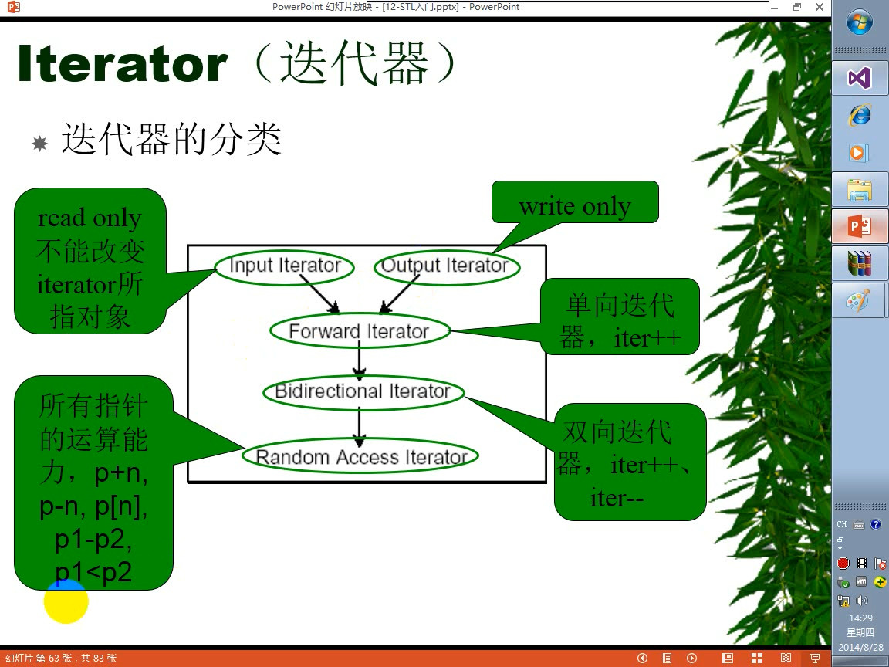

    # CPP 学习笔记
  > 可以直接下载pdf  [CPP 学习笔记](CPP学习笔记.pdf)

<!-- TOC -->

- [0.1. 多线程](#01-多线程)
    - [0.1.1. 文件操作已经学完，今天看下多线程](#011-文件操作已经学完今天看下多线程)
        - [0.1.1.1. 知识点１](#0111-知识点１)
        - [0.1.1.2. 代码1](#0112-代码1)
        - [0.1.1.3. 知识点２](#0113-知识点２)
    - [0.1.2. 知识点３](#012-知识点３)
        - [0.1.2.1. 代码３](#0121-代码３)
- [0.2. STL](#02-stl)
    - [0.2.1. STL 学习，没有带笔记本回来。。。我日 2019.11.11 23:21](#021-stl-学习没有带笔记本回来我日-20191111-2321)
        - [0.2.1.1. STL的概念](#0211-stl的概念)
        - [0.2.1.2. 代码](#0212-代码)
        - [0.2.1.3. STL抽象的是什么](#0213-stl抽象的是什么)
    - [0.2.2. 六大组件](#022-六大组件)
        - [0.2.2.1. vector 动态数组 堆上](#0221-vector-动态数组-堆上)
        - [0.2.2.2. tuple 可以存储不同的数据类型](#0222-tuple-可以存储不同的数据类型)
        - [0.2.2.3. list 适合经常插入，经常删除的情况](#0223-list-适合经常插入经常删除的情况)
        - [0.2.2.4. list 容器](#0224-list-容器)
        - [0.2.2.5. set 容器 （红黑树容器）](#0225-set-容器-红黑树容器)
    - [0.2.3. algorithm 算法](#023-algorithm-算法)
    - [0.2.4. Iterator](#024-iterator)
        - [0.2.4.1. 仿函数](#0241-仿函数)
    - [0.2.5. wmv STL Bug 迭代器](#025-wmv-stl-bug-迭代器)
    - [0.2.6. wmv 栈队列双端队列优先队列](#026-wmv-栈队列双端队列优先队列)
        - [0.2.6.1. stack 关键字可以构建栈](#0261-stack-关键字可以构建栈)
        - [0.2.6.2. queue  队列](#0262-queue--队列)
        - [0.2.6.3. deque 双端队列](#0263-deque-双端队列)
        - [0.2.6.4. priority_que 优先级队列 （不太理解）](#0264-priority_que-优先级队列-不太理解)
    - [0.2.7. 红黑树容器](#027-红黑树容器)
        - [0.2.7.1. set 是一个红黑树](#0271-set-是一个红黑树)
    - [0.2.8. set map multi-map 红黑树](#028-set-map-multi-map-红黑树)
        - [0.2.8.1. set的高级用法](#0281-set的高级用法)
        - [0.2.8.2. multiset](#0282-multiset)
        - [0.2.8.3. map  映射 multimap 多层映射 &nbsp;9.wmv 53:41](#0283-map--映射-multimap-多层映射-nbsp9wmv-5341)
        - [0.2.8.4. pair 关键字 &nbsp;9.wmv 01:23:15](#0284-pair-关键字-nbsp9wmv-012315)
        - [0.2.8.5. hash_set 和hash_map &nbsp;9.wmv 01:33:10](#0285-hash_set-和hash_map-nbsp9wmv-013310)
        - [0.2.8.6. equal_range()](#0286-equal_range)
    - [0.2.9. string 本质是一个容器](#029-string-本质是一个容器)
            - [0.2.9.0.1. 网上扒来的 string 介绍](#02901-网上扒来的-string-介绍)
    - [0.2.10. GPU编程](#0210-gpu编程)
        - [0.2.10.1. Lamda 表达式 C++ AMP 编程](#02101-lamda-表达式-c-amp-编程)
- [0.3. 设计模式](#03-设计模式)
    - [0.3.1. 备忘录模式](#031-备忘录模式)
    - [0.3.2. 策略模式](#032-策略模式)
    - [0.3.3. 设计模式 抽象工厂模式](#033-设计模式-抽象工厂模式)
    - [0.3.4. 简单工厂模式](#034-简单工厂模式)
    - [0.3.5. 方法工厂模式](#035-方法工厂模式)
    - [抽象工厂模式](#抽象工厂模式)
    - [单例模式](#单例模式)
    - [代理模式](#代理模式)
    - [迭代器模式](#迭代器模式)
    - [命令行模式](#命令行模式)
    - [责任链模式：](#责任链模式)
- [数据结构与算法](#数据结构与算法)
    - [总览](#总览)
    - [概论](#概论)
    - [算法的特性](#算法的特性)
    - [算法的衡量标准](#算法的衡量标准)
    - [Boost和算法](#boost和算法)
        - [boost Array 第一只boost 程序](#boost-array-第一只boost-程序)
        - [boost 库的学习 boost_array_bind_fun_ref](#boost-库的学习-boost_array_bind_fun_ref)
        - [std 方式](#std-方式)
            - [boost方式](#boost方式)
        - [boost::function 库](#boostfunction-库)
        - [boost::ref](#boostref)
        - [RAII](#raii)
        - [智能指针 smartpointers 库](#智能指针-smartpointers-库)
    - [类的虚函数表](#类的虚函数表)
    - [一个自己实现的Vector(只能处理基本类型数据)](#一个自己实现的vector只能处理基本类型数据)
    - [红黑树](#红黑树)
- [Boost 学习笔记](#boost-学习笔记)
    - [有用的](#有用的)
    - [Smart Pointer](#smart-pointer)
        - [智能指针 ：shared_ptr weak_ptr scoped_ptr  scoped_array  intrusive_ptr,](#智能指针-shared_ptr-weak_ptr-scoped_ptr--scoped_array--intrusive_ptr)
            - [Smart_ptr 库如何改进你的程序？](#smart_ptr-库如何改进你的程序)
            - [有三种典型的情况适合使用智能指针：](#有三种典型的情况适合使用智能指针)
            - [boost智能指针的优势](#boost智能指针的优势)
        - [scoped_ptr](#scoped_ptr)
            - [scoped_ptr 的用法](#scoped_ptr-的用法)
            - [scoped_ptr 和 Pimpl 用法](#scoped_ptr-和-pimpl-用法)
            - [scoped_ptr 与 const auto_ptr 的区别](#scoped_ptr-与-const-auto_ptr-的区别)
            - [总结](#总结)
        - [scoped_array](#scoped_array)
        - [shared_ptr](#shared_ptr)
            - [作用](#作用)
        - [Shared_ptr 定义](#shared_ptr-定义)
        - [Shared_ptr 内部构造](#shared_ptr-内部构造)
    - [代码示例](#代码示例)
- [QT 学习](#qt-学习)
    - [0.1.1. 坐标系统](#011-坐标系统)
    - [0.1.2. layouts](#012-layouts)
    - [0.1.3. 控件](#013-控件)
    - [0.1.4. 消息基础](#014-消息基础)
    - [0.1.5. QT 消息中级](#015-qt-消息中级)
        - [0.1.5.1. eventFilter 截取消息](#0151-eventfilter-截取消息)
        - [1.0.5.2. notify 通知消息](#1052-notify-通知消息)
        - [1.0.5.3. postEvent 和 sendEvent](#1053-postevent-和-sendevent)
    - [1.0.6. QPainter 和重写自定义控件](#106-qpainter-和重写自定义控件)
        - [1.0.6.1. QPainter 的绘图效率(引用)](#1061-qpainter-的绘图效率引用)
        - [1.0.6.2. QPainter 实现自己的控件](#1062-qpainter-实现自己的控件)
    - [1.0.7. 信号和槽](#107-信号和槽)
        - [1.0.7.1. 定义](#1071-定义)
        - [1.0.7.2. 需要注意的事项](#1072-需要注意的事项)
        - [1.0.7.3. 总结：](#1073-总结)
    - [1.0.8. 高级Painter](#108-高级painter)
    - [1.0.9. QDialog](#109-qdialog)
        - [1.0.9.1. 代码展示](#1091-代码展示)
    - [1.0.10. MainWindow](#1010-mainwindow)
    - [1.0.11. QFile-QBuffer-QXXXXStream-Mapping](#1011-qfile-qbuffer-qxxxxstream-mapping)
        - [1.0.11.1. QFile](#10111-qfile)
        - [1.0.11.2. QBuffer //内存 文件](#10112-qbuffer-内存-文件)
        - [1.0.11.3. QDataStream QTextStream](#10113-qdatastream-qtextstream)
    - [1.0.12. Socket-TCP-UDP-BOARDCAST-MULI-CAST](#1012-socket-tcp-udp-boardcast-muli-cast)
    - [1.0.13. 关于在new 生成控件的时候this 的解释 和 deleteLater](#1013-关于在new-生成控件的时候this-的解释-和-deletelater)
        - [1.0.13.1. 关于在new 生成控件的时候this](#10131-关于在new-生成控件的时候this)
        - [1.0.13.2. deleteLater](#10132-deletelater)
    - [1.0.14. QT动态库](#1014-qt动态库)
    - [1.0.15. QT静态库](#1015-qt静态库)
    - [1.0.16. QT JSON](#1016-qt-json)
    - [1.0.17. QT 加密](#1017-qt-加密)
    - [1.0.18. QSQLDatabase 的使用](#1018-qsqldatabase-的使用)
        - [1.0.18.1. 编译Mysql 驱动](#10181-编译mysql-驱动)
    - [1.0.19. QSQLDatabase 的使用](#1019-qsqldatabase-的使用)
        - [1.0.19.1. 原生执行SQL语句](#10191-原生执行sql语句)
        - [1.0.19.2. QSQLModel 方式 执行](#10192-qsqlmodel-方式-执行)
        - [1.0.19.3. QTableView 特别方便](#10193-qtableview-特别方便)
    - [1.0.20. Qprocess 的使用](#1020-qprocess-的使用)

<!-- /TOC -->


<a id="markdown-01-多线程" name="01-多线程"></a>
## 0.1. 多线程
<a id="markdown-011-文件操作已经学完今天看下多线程" name="011-文件操作已经学完今天看下多线程"></a>
### 0.1.1. 文件操作已经学完，今天看下多线程  
>> 2019.11.11 15:06
<a id="markdown-0111-知识点１" name="0111-知识点１"></a>
#### 0.1.1.1. 知识点１
<li> Linux 下编译 带&ltthread&gt 的CPP需要加上 -pthread 编译选项。例如：
```
g++ -std=c++11 -pthread a.cpp

```
<li>QT Creator 编译带&ltthread&gt的CPP有ＢＵＧ，暂时不知道怎么去除！

<a id="markdown-0112-代码1" name="0112-代码1"></a>
#### 0.1.1.2. 代码1

```#include <iostream>
#include <stdlib.h>v
#include <thread>

using namespace std;
void run(char* p)
{
    int i=0;
    i=system(p);
}

int main()
{
    char p[5][20]={
        "ls",
        "echo nihao",
        "gnome-terminal",
        "terminator",
        "ps -aux"

    };

    while("nimei")
    {
       static  int i(0);
        if(i<5){
            thread  *pt=new  thread(run,p[i]);
            i+=1;
            cout<<"I now is :\t"<<i<<endl;
        }
        else{
            break;
        }

        cout<<"Breaking...."<<endl;
    }


    cin.get();
    return 0;
}
```
<a id="markdown-0113-知识点２" name="0113-知识点２"></a>
#### 0.1.1.3. 知识点２

<li> 关于thread类的内部成

| 关键字                       | 详细解释                                             |
| ---------------------------- | ---------------------------------------------------- |
| id                           | Thread的iｄ                                          |
| native_handle_type           | native_handle_type                                   |
| operator=                    | Move massive Thread                                  |
| get_id                       | get Thread ID                                        |
| joinable                     | get if joinable                                      |
| join                         | join thread                                          |
| detach                       | detach thread                                        |
| swap                         | swap thread                                          |
| native_handle                | get native handle                                    |
| hardware_concurrency[static] | Detect hardware concurrency (public static function) |


<li> 线程 detach 脱离主线程的绑定，主线程挂了，子线程不报错，子线程执行完自动退出。

<li> 线程 detach以后，子线程会成为孤儿线程，线程之间将无法通信。

<a id="markdown-012-知识点３" name="012-知识点３"></a>
### 0.1.2. 知识点３

<li>线程中变量的竞争控制是通过 mutex automic 来实现的

<li>mutex : 互斥量。需要包含头文件　&ltmutex> 来使用　-->速度慢

<li>atomic 原子变量。需要包含头文件&ltatomic>来实现　-->速度快，线程安全。

<a id="markdown-0121-代码３" name="0121-代码３"></a>
#### 0.1.2.1. 代码３

```
#include <iostream>
#include <stdlib.h>
#include <thread>
#include <atomic>

using namespace std;
int count(0);

void run()
{
    for(int i(0);i<1000000;i++)
    {
        count++;
        cout<<"\t"<<i<<"\t"<<count<<"\t";
    }
}

int main()
{
    auto n=thread::hardware_concurrency();

    thread* pt[n];
    for(int z=0;z<n;z++)
    {
        pt[z]=new thread(run);
        pt[z]->detach();

    }

    cout<<"Finally count is \t"<<count<<endl;
    cout<<"Used "<<n <<"threads"<<endl;


    cin.get();
    return 0;
}
```

<em>运行结果不是1000000×２．

```#include <iostream>
#include <stdlib.h>
#include <thread>
#include <atomic>

using namespace std;
int count(0);

void run()
{
    for(int i(0);i<1000000;i++)
    {
        count++;
        cout<<"\t"<<i<<"\t"<<count<<"\t";
    }
}

int main()
{
    auto n=thread::hardware_concurrency();

    thread* pt[n];
    for(int z=0;z<n;z++)
    {
        pt[z]=new thread(run);
        pt[z]->detach();

    }

    cout<<"Finally count is \t"<<count<<endl;
    cout<<"Used "<<n <<"threads"<<endl;


    cin.get();
    return 0;
}
```
<em>运行结果是1000000×２．正确

<li><em>atomic 声明方式为　atomic&ltint> a(100); 等号初始化会报错

<li><em>vim 按ＣＴＲＬ+S 后假死按　ＣＴＲＬ＋q 退出

<a id="markdown-02-stl" name="02-stl"></a>
## 0.2. STL
<a id="markdown-021-stl-学习没有带笔记本回来我日-20191111-2321" name="021-stl-学习没有带笔记本回来我日-20191111-2321"></a>
### 0.2.1. STL 学习，没有带笔记本回来。。。我日 2019.11.11 23:21

<a id="markdown-0211-stl的概念" name="0211-stl的概念"></a>
#### 0.2.1.1. STL的概念

<li> Iterator  (迭代器)
<li> Container (容器) array
<li> Alogrithm (算法)
<li> Adapters (配接器) 用来实现容器之间的转接<br>
 面向过程--》面向对象-》基于对象-》泛型

<a id="markdown-0212-代码" name="0212-代码"></a>
#### 0.2.1.2. 代码

```
#include <iostream>
#include <vector> //容器
#include <algorithm> //算法

using namespace std;

//专么实现一个类模板，实现打印
//类模板实现了方法
template <class T>
class vector_s {
public:
void operator()(const T &t1) //重载了小括号 实现访问小括号就直接打印
	{
		cout << t1 << endl;
	}
};

int main(void)
{
	vector<int> myv;
	myv.push_back(13);
	myv.push_back(23);
	myv.push_back(33);
	myv.push_back(113);
	myv.push_back(1995);
	myv.push_back(1996);

	vector_s<int> print; // 对打印实现实例化

    //myv.begin(), myv.end() 是迭代器 本质是指针
    // for_each 本质是一个算法
	for_each(myv.begin(), myv.end(), print);

	cin.get();


	return 0;
}
```

<br>
<li>注意：算法需要包含头文件 &ltalgorithm&gt <br>
<li>这个遍历的函数为 for_each 不是foreach<br>
<li>算法可以适用于任何容器<br>

<a id="markdown-0213-stl抽象的是什么" name="0213-stl抽象的是什么"></a>
#### 0.2.1.3. STL抽象的是什么

-有些算法并不依赖于数据结构的特定实现，而只依赖于该结构的几个基本语义属性

-STL 抽象出的这些基本属性（concept）成功的将算法和数据结构相分离，在没有效率损失的前提下，获得了极大的弹性！

<a id="markdown-022-六大组件" name="022-六大组件"></a>
### 0.2.2. 六大组件

-容器 （container)

-算法Algorithm

-迭代器 （iterator）

-仿函数 （Function Object)

-适配器 （Adaptor）

-空间制配器 （allocator)


获取远程代码修改后,想要push到远端与原来不同的新分支，可以使用下面的命令实现：
git push origin 本地分支:远端希望创建的分支


例如git下来的分支为master
```

git branch master
git push origin master:my_remote_new_branch
#远端即可创建新的分支my_remote_new_branch,提交本地修改

```
<!-- ### 2019.11.13 9:32 -->

``` std::for_each(arr.begin(), arr.end(), func);```

 比较有用的for_each 用法

 ```for (auto n:Original)```

 C++ 11 新的for

<!-- ### 2019.11.03 23:46 -->

#### typename
- 成员函数也可以是模板-
- typename 作为类型前的标识符号-


 ```template <class T>
class MyClass
        typename T::SubType *  ptr; //typename 直接指示 T::SubType * 为一个类型 没有typename 会被解析为
            // T域中的 SubType 静态成员 乘于（*） ptr.
        ...
        };
 ```


-typename 的第二个作用：在模板声明中替换class -

  ```template <typename T > class Myclass;```


####  static_cast 只有当类型转换有所定义，转换才会成功。（明确转换类型）
####  dynamic_cast 将多态类型向下转换\<downcast> 被转换的类必须有虚函数。否则失败
####  const_cast 用于转换为const 值
####  reinterpret_cast 多用于指针个的转换
####  C语言的小括号（）可以替换除dymanic_cast 外的所有静态转换函数，无法明确显示使用他们的切确理由

### 容器的概念
-用于管理一组元素


#### 容器的分类
##### -序列式容器\(Sequence containers)
-每个元素都有固定位置--去结余插入时机和地点，和元素值无关
-vector list  deque
##### 关联式容器 \(Associated containers)
-元素取决于特定的排序准则，和插入顺序无关
-set multiset map multimap


#### array
``` array <int ,5>={1,2,3,4,5};```
-静态数组，栈上
<a id="markdown-0221-vector-动态数组-堆上" name="0221-vector-动态数组-堆上"></a>
#### 0.2.2.1. vector 动态数组 堆上
  ```vector <int> mv;
   mv.push_back()
   ```
   -不需要变长，容量较小，array 需要变长，容量较大，用vector

<a id="markdown-0222-tuple-可以存储不同的数据类型" name="0222-tuple-可以存储不同的数据类型"></a>
#### 0.2.2.2. tuple 可以存储不同的数据类型

<a id="markdown-0223-list-适合经常插入经常删除的情况" name="0223-list-适合经常插入经常删除的情况"></a>
#### 0.2.2.3. list 适合经常插入，经常删除的情况


<a id="markdown-0224-list-容器" name="0224-list-容器"></a>
#### 0.2.2.4. list 容器

-list容器是无序容器

-list 容器只能通过迭代器访问。通过++ -- 遍历

-list容器可以使用remove（）方法删除元素，

-可以同时正向和反向查找

-可以使用sort()函数排序

-可以使用merge 合并，但是合并之前必须排序

-可以使用unique()函数删除重复项，删除前必须排序。

--merge (使)合并，结合，并入;相融;融入;渐渐消失在某物中

<a id="markdown-0225-set-容器-红黑树容器" name="0225-set-容器-红黑树容器"></a>
#### 0.2.2.5. set 容器 （红黑树容器）

-set容器不能有重复项，重复的会被舍弃
-set容器会自动排序
-set 用insert插入元素
-set可以用find（）函数查找位置

循环加栈


<a id="markdown-023-algorithm-算法" name="023-algorithm-算法"></a>
### 0.2.3. algorithm 算法

find（）函数可以查找数组、容器中的元素。

for_each(); 遍历每一个元素。

multiset和set差不多，但是允许重复元素。

迭代器本质是智能指针。

<a id="markdown-024-iterator" name="024-iterator"></a>
### 0.2.4. Iterator


<a id="markdown-0241-仿函数" name="0241-仿函数"></a>
#### 0.2.4.1. 仿函数

```auto ifind=find_if(mylist.bengin(),mylisy.end(),bindlst(greater<int>(),3));```

bindlst 需要头文件 funtional   ```#include <functional>```

```bindlst(greater<int>(),3);```  绑定一个函数。 ```greater<int>() ```  是一个仿函数（functional)  是一个重载了（）的类/结构 体 ，可以用来实现一定的算法策略。

仿函数例子：
``` #include <iostream>
#include <list>
#include <functional>
#include <array>
#include <algorithm>

using namespace std;


class shuchu {
  public:

  void operator()(int x)
  {
    std::cout<<x<<endl;
  }
};


 int main(int argc, char const *argv[]) {
  /* code */

  // array<int,5>array1({1,2,3,4,5});
  list <int>ls1;
  ls1.push_back(1);
   ls1.push_back(3);
    ls1.push_back(5);
     ls1.push_back(7);
      ls1.push_back(9);
  auto ib=ls1.begin();
  auto ie=ls1.end();
  for_each(ib,ie,shuchu());
  cin.get();
  return 0;
}

```

<a id="markdown-025-wmv-stl-bug-迭代器" name="025-wmv-stl-bug-迭代器"></a>
### 0.2.5. wmv STL Bug 迭代器 
>>2019.11.15  

-智能指针有一个_Ptr属性，可以打印里面的指针。

-STL 有bug 先访问迭代器的_Ptr属性，再访问迭代器指针正常，但是反过来会出错。

-分行打印就没有问题。


<a id="markdown-026-wmv-栈队列双端队列优先队列" name="026-wmv-栈队列双端队列优先队列"></a>
### 0.2.6. wmv 栈队列双端队列优先队列
>> 2019.11.15 

<a id="markdown-0261-stack-关键字可以构建栈" name="0261-stack-关键字可以构建栈"></a>
#### 0.2.6.1. stack 关键字可以构建栈

-用法

```stack <mystack>;  //声明一个栈```
```mystack.push(num); //压栈```
```mystack.pop(); //出栈```
```mystack.top(); //获取第一个元素```


stack成员函数示例
-size( ) :返回栈中元素个数
-top( ) :返回栈顶的元素
-pop( ) :从栈中取出并删除元素
-push(e) :向栈中添加元素e
-empty( ) :栈为空时返回true


<a id="markdown-0262-queue--队列" name="0262-queue--队列"></a>
#### 0.2.6.2. queue  队列

-queue 英 [kjuː]   美 [kjuː]  

n.(人、汽车等的)队，行列;(储存的数据)队列
v.(人、车等)排队等候;(使)排队;列队等待

-queue 需要头文件 \<queue>

-从网上拔来的Queue

[queue详解](queue.md)

<h2>queue 操作</h2>
queue 和 stack 有一些成员函数相似，但在一些情况下，工作方式有些不同：<br>
<ul>
<li>
front()：返回 queue 中第一个元素的引用。如果 queue 是常量，就返回一个常引用；如果 queue 为空，返回值是未定义的。</li>
<li>
back()：返回 queue 中最后一个元素的引用。如果 queue 是常量，就返回一个常引用；如果 queue 为空，返回值是未定义的。</li>
<li>
push(const T&amp; obj)：在 queue 的尾部添加一个元素的副本。这是通过调用底层容器的成员函数 push_back() 来完成的。</li>
<li>
push(T&amp;&amp; obj)：以移动的方式在 queue 的尾部添加元素。这是通过调用底层容器的具有右值引用参数的成员函数 push_back() 来完成的。</li>
<li>
pop()：删除 queue 中的第一个元素。</li>
<li>
size()：返回 queue 中元素的个数。</li>
<li>
empty()：如果 queue 中没有元素的话，返回 true。</li>
<li>
emplace()：用传给 emplace() 的参数调用 T 的构造函数，在 queue 的尾部生成对象。</li>
<li>
swap(queue&lt;T&gt; &amp;other_q)：将当前 queue 中的元素和参数 queue 中的元素交换。它们需要包含相同类型的元素。也可以调用全局函数模板&nbsp;swap() 来完成同样的操作。</li>
</ul>
<br>
queue&lt;T&gt; 模板定义了拷贝和移动版的 operator=()，对于所保存元素类型相同的 queue 对象，它们有一整套的比较运算符，这些运算符的工作方式和 stack 容器相同。<br>

<a id="markdown-0263-deque-双端队列" name="0263-deque-双端队列"></a>
#### 0.2.6.3. deque 双端队列

- deque 可以从头部push_front()和尾部push_back()插入 
- deque 可以使用迭代器 可以使用 迭代器+n 访问删除
- deque 可以pop_front() pop_back() 从头部和尾部 删除元素。

(1)    构造函数

deque():创建一个空deque

deque(int nSize):创建一个deque,元素个数为nSize

deque(int nSize,const T& t):创建一个deque,元素个数为nSize,且值均为t

deque(const deque &):复制构造函数

(2)    增加函数

void push_front(const T& x):双端队列头部增加一个元素X

void push_back(const T& x):双端队列尾部增加一个元素x

iterator insert(iterator it,const T& x):双端队列中某一元素前增加一个元素x

void insert(iterator it,int n,const T& x):双端队列中某一元素前增加n个相同的元素x

void insert(iterator it,const_iterator first,const_iteratorlast):双端队列中某一元素前插入另一个相同类型向量的[forst,last)间的数据

(3)    删除函数

Iterator erase(iterator it):删除双端队列中的某一个元素

Iterator erase(iterator first,iterator last):删除双端队列中[first,last）中的元素

void pop_front():删除双端队列中最前一个元素

void pop_back():删除双端队列中最后一个元素

void clear():清空双端队列中最后一个元素

(4)    遍历函数

reference at(int pos):返回pos位置元素的引用

reference front():返回手元素的引用

reference back():返回尾元素的引用

iterator begin():返回向量头指针，指向第一个元素

iterator end():返回指向向量中最后一个元素下一个元素的指针（不包含在向量中）

reverse_iterator rbegin():反向迭代器，指向最后一个元素

reverse_iterator rend():反向迭代器，指向第一个元素的前一个元素

(5)    判断函数

bool empty() const:向量是否为空，若true,则向量中无元素

(6)    大小函数

Int size() const:返回向量中元素的个数

int max_size() const:返回最大可允许的双端对了元素数量值

(7)    其他函数

void swap(deque&):交换两个同类型向量的数据

void assign(int n,const T& x):向量中第n个元素的值设置为x
 
[deque网上扒来的](deque.md)

<a id="markdown-0264-priority_que-优先级队列-不太理解" name="0264-priority_que-优先级队列-不太理解"></a>
#### 0.2.6.4. priority_que 优先级队列 （不太理解）

- 优先队列是按照堆来实现的

<a id="markdown-027-红黑树容器" name="027-红黑树容器"></a>
### 0.2.7. 红黑树容器

<a id="markdown-0271-set-是一个红黑树" name="0271-set-是一个红黑树"></a>
#### 0.2.7.1. set 是一个红黑树


<a id="markdown-028-set-map-multi-map-红黑树" name="028-set-map-multi-map-红黑树"></a>
### 0.2.8. set map multi-map 红黑树

<a id="markdown-0281-set的高级用法" name="0281-set的高级用法"></a>
#### 0.2.8.1. set的高级用法
- 红黑树，处理纯字符串比较少，处理字符串及对象比较多。
- pair 复合集合
- 二叉树查找依赖于有序。 字符串可以实现有序。
- pair 也是个类模板！起到获取插入返回值（boolean)的作用。两个参数，第一个类型，第二个是比大小的方法
- set的每一个节点就是一个节点
- 二叉树的实现语法一直在在在变 。VS2013 能过的 VS2017 就不能过了！~！！mingw 32又能过，代码如下：
- set 不能包含同样的值
-  0-35:40
```#include <iostream>
#include <set>
#include <string>
#include <stdio.h>
#include <string.h>

using namespace std;

class strless
{
public:

    bool operator () (const char* p,const char* p1)
    {
        return strcmp(p, p1) < 0;
    }

private:

};


int main(void)
{
    const char* cmd[] = { "nihao","spectrc","calc","good" };
    set<const char *, strless>myset(cmd,cmd+4,strless());
    auto ib = myset.begin();
    auto ie = myset.end();

    for (auto i : myset)
    {
        cout << i << endl;
    }


    return 0;

}
```
<a id="markdown-0282-multiset" name="0282-multiset"></a>
#### 0.2.8.2. multiset
- 可以插入相同的值
- multiset 的每一个节点是一个链表
- 练习代码如下（mingw 32编译）：
```#include <iostream>
#include <set>
#include <string.h>

using namespace std;

class stu{
public:
    int id;
    char p[100];
};

class stuless
{
public:

    bool operator ()(const stu &st1,const stu &st2)
    {
        return st1.id<st2.id;
    }

};


int main()
{
    stu student[3]={
        {99,"zhuang"},
        {15,"li"},
        {3,"ooooo"}
    };

    stu newstu;
    newstu.id=100782;
    strcpy(newstu.p,"nimeide");
    multiset<stu,stuless> stu1 (student,student+3,stuless());
    stu1.insert(newstu);
    strcpy(newstu.p,"SBSBSBSB");
    stu1.insert(newstu);
     strcpy(newstu.p,"luo liuo");
    stu1.insert(newstu);

    for(auto i:stu1)
    {
        cout<< "\t"<<i.id<<"\t"<<i.p<<endl;
    }

    return 0;

}
```

- 输出

- 


<a id="markdown-0283-map--映射-multimap-多层映射-nbsp9wmv-5341" name="0283-map--映射-multimap-多层映射-nbsp9wmv-5341"></a>
#### 0.2.8.3. map  映射 multimap 多层映射 &nbsp;9.wmv 53:41

- map 也是 红黑树，但是能同时映射多个数据
- map 需要头文件 \<map>
- 映射都是左边映射到右边。访问时用右边访问左边。可以通过对等的映射查找
- 示例代码如下：

```#include <iostream>
#include <string>
#include <map>
#include <stdlib.h>

using namespace std;

class worker{

public:
    int id;
    string name;
    string work;
};


class winfo{
public:
    int randid;
     worker w1;

};


int main()
{
    system("chcp 65001");

    winfo warr[]={

        {1,{10,"李四","mugong"}},
         {2,{9,"张三","mugong"}},
         {8,{5,"wangermazi","mugong"}},
         {20,{3,"gg","mugong"}},
         {30,{1,"ww张三","mugong"}}
    };

    map <int,worker> m;
    for(auto i : warr)
    {
        static int n=0;
        m[warr[n].randid]=warr[n].w1;
        n++;
    }

    auto ib=m.begin();
    auto ie=m.end();

    for(;ib!=ie;ib++)
    {
        cout<<"\t winfo.randid is \t"<<(*ib).first<<" worker info is \t"<<(*ib).second.id<<"\t"<<(*ib).second.name
           <<"\t"<<(*ib).second.work<<"\t"<<endl;
    }

    return 0;
}
```

- 输出
  
  


<a id="markdown-0284-pair-关键字-nbsp9wmv-012315" name="0284-pair-关键字-nbsp9wmv-012315"></a>
#### 0.2.8.4. pair 关键字 &nbsp;9.wmv 01:23:15 

- 用于插入 复杂映射类型
- multimap set map 每一个节点就是一个 pair
- 用法：
  
```multimap <const char*,int>m;
m.insert(pair<const char*,int> ("第一个"),1);
m.insert(pair<const char*,int> ("第二个"),2);
m.insert(pair<const char*,int> ("第三个"),5);
m.insert(pair<const char*,int> ("第四个"),8);

```
<a id="markdown-0285-hash_set-和hash_map-nbsp9wmv-013310" name="0285-hash_set-和hash_map-nbsp9wmv-013310"></a>
#### 0.2.8.5. hash_set 和hash_map &nbsp;9.wmv 01:33:10

- 作用：把比较大的数据抽象得比较小
- hash_set 不会自动排序 查找时一次就足够了。而set需要 log2n 次
- 适用于精确查找，一次就能找到。比二分查找要快
- hash_set 的经典用法 判断数据是否相等
- hash_set、hash_map 不会自动排序 
- hash算法依赖于hash_table

<a id="markdown-0286-equal_range" name="0286-equal_range"></a>
#### 0.2.8.6. equal_range()
- 找到红黑树的链表节点，遍历所有节点
- first为链表的首节点，second 为最后一个空节点

<a id="markdown-029-string-本质是一个容器" name="029-string-本质是一个容器"></a>
### 0.2.9. string 本质是一个容器

- C语言中 下列代码是错误的：
``` 
char str[54];
str="123456";
```

- erase() 函数可删除字符串。 str1.erase(3,4); erase(str1.begin(),str.begin()+2);

- replace() 替换函数 str1.replace(3,3,"China");str1.replace(3,"China");
str1.replace(3,"China"); replace (位置，长度，字符串)；
- str.find() 查找字符串，找到第一个匹配的字符的位置，找不到返回-1；
- rfind（） 反向查找，返回找的的第一个的匹配的字符串的位置。找不到返回-1；

- find_first_of () 找到第一个并返回所在位置。

- find_first_not_of () 找到第一个不匹配的并返回所在位置。

- find_last_of () 找到最后一个匹配的并返回所在位置。

- find_last_not_of () 找到最后一个不匹配的并返回所在位置。

<a id="markdown-02901-网上扒来的-string-介绍" name="02901-网上扒来的-string-介绍"></a>
##### 0.2.9.0.1. 网上扒来的 string 介绍

- [String](string.md)


<a id="markdown-0210-gpu编程" name="0210-gpu编程"></a>
### 0.2.10. GPU编程 
- 可以利用模板类实现对容器的操作（利用重载括号的方式）
<a id="markdown-02101-lamda-表达式-c-amp-编程" name="02101-lamda-表达式-c-amp-编程"></a>
#### 0.2.10.1. Lamda 表达式 C++ AMP 编程
- 函数包装器(LAMDA 表达式，类似JS里面的匿名函数) : 需要头文件 <functional>
- GPU 强项在于并行计算，CPU强项在于单点计算
```
auto func=[](int a ,int b){ return a+b;};

for_each(myvector.begin(),myvector.end(),[](int a){return a*=2;cout<<a<<endl;});
```
- C++ AMP 计算演示 (VS 2017中编译失败)
- VS2017 中错误信息：
```

```
严重性	代码	说明	项目	文件	行	禁止显示状态
错误	C3861	“_Access”: 找不到标识符	GPU_hello	c:\program files (x86)\microsoft visual studio\2017\enterprise\vc\tools\msvc\14.15.26726\include\amp.h	2616	

严重性	代码	说明	项目	文件	行	禁止显示状态
错误	C3588	在 amp 限制代码中不支持从“unknown-type”转换为“void *”	GPU_hello	c:\program files (x86)\microsoft visual studio\2017\enterprise\vc\tools\msvc\14.15.26726\include\amp.h	2616	


```
#include <amp.h>
#include <iostream>

using namespace std;
using namespace concurrency;

int main(void)
{
	int a[10] = { 1,2,3,4,5,6,7,8,9,10 };
	array_view<int> av(10, a); //GPU 计算结构 AV 存储到GPU的显存
	/*
	*[=](index<1>idx) restrict (amp) {av[idx] *= 2; }
	* [=] 标识直接操作这个数据  
	* restrict (amp)  标识定位到 GPU进行运算
	*这个表达式为Lambda表达式
	*/

	parallel_for_each(av.extent, [=](index<1> idx) restrict (amp) {av[idx] *= 2; });
	
	for (int i = 0; i < 10; i++)
	{

		cout << "\t" << av[i] << endl;
	}
	


	cin.get();
}
```


<a id="markdown-03-设计模式" name="03-设计模式"></a>
## 0.3. 设计模式

<a id="markdown-031-备忘录模式" name="031-备忘录模式"></a>
### 0.3.1. 备忘录模式

- 在一个类内部记录另一个类的快照状态的模式。可以再合适的时候跳回复用

- 设计备忘录的三大步骤：
1. 设计记录的节点，存储记录
2.设计记录的存储： vector list map set 可以使 链表 图 数组 树
3.操作记录的类，记录节点状态，设置节点状态，显示节点状态

<a id="markdown-032-策略模式" name="032-策略模式"></a>
### 0.3.2. 策略模式

- 策略模式针对一组算法，将每一个算法封装到具有共同接口的独立类中。

- 从而使得他们可以相互转换，策略模式可以在不影响客户端的情况下使算法发生改变。策略模式把行为和环境分离开来，环境类负责维持和查询行为类。

- 策略模式依赖多态，策略模式的抽象类，接口，抽象类的指针可以访问所有子类对象（纯虚函数）
- 各种策略的实现类。都必须集成抽象类。
- 策略的设置接口类。设置不同的策略
=======
<a id="markdown-033-设计模式-抽象工厂模式" name="033-设计模式-抽象工厂模式"></a>
### 0.3.3. 设计模式 抽象工厂模式
- 工厂模式： 客户类和工厂类分开。
- 消费者需要任何产品，只需要和工厂请求就可以了。
- 消费者无需修改就可以接纳新产品，缺点是当产品修改时，工厂类也要做相应的修改

=======

<a id="markdown-034-简单工厂模式" name="034-简单工厂模式"></a>
### 0.3.4. 简单工厂模式
- 基类存放数据 派生类存放操作
- 再实现一个调用各个操作的静态类，调用时返回派生类指针

代码： [simple_factory](simple_factory.cpp)


<a id="markdown-035-方法工厂模式" name="035-方法工厂模式"></a>
### 0.3.5. 方法工厂模式

- 把操作和实例化工厂的类分别抽象出来
- 通过继承抽象类实现不同的操作
- 方法工厂模式就是简单工厂模式把工厂进行抽象并且进行封装后得到的

代码： [factory_method](factory_method.cpp)

>>> 不能在linux 下编译！！！ 报错 only nonstatic member functions may be virtual

<a id="markdown-抽象工厂模式" name="抽象工厂模式"></a>
### 抽象工厂模式

- 工厂模式： 客户类和工厂类分开。
- 消费者需要任何产品，只需要和工厂请求就可以了。
- 消费者无需修改就可以接纳新产品，缺点是当产品修改时，工厂类也要做相应的修改
- 消费者 工厂 商品都有自己的抽象类并且通过继承 实例化 抽象接口 ，提供不同的服务

<!-- 2.wmv 56.28 -->

<a id="markdown-单例模式" name="单例模式"></a>
### 单例模式

- 单例模式确认某个类只有只有一个实例
- 有两种实现模式： 1.匿名类的声明 &nbsp; 2.通过内部的静态类指针来实现
- 单例模式：单例模式确保某一个类只有一个实例，
- 而且自行实例化并向整个系统提供这个实例单例模式
- 单例模式只应在有真正的“单一实例”的需求时才可使用。

```
class {
    public:
    int a=100;
    }aa;
```

[示例](SingleInstance.cpp)

<a id="markdown-代理模式" name="代理模式"></a>
### 代理模式

- 代理模式：代理模式给某一个对象提供一个代理对象，
- 并由代理对象控制对源对象的引用。
- 代理就是一个人或一个机构代表另一个人或者一个机构采取行动。
- 某些情况下，客户不想或者不能够直接引用一个对象，
- 代理对象可以在客户和目标对象直接起到中介的作用。
- 客户端分辨不出代理主题对象与真实主题对象。
- 代理模式可以并不知道真正的被代理对象，
- 而仅仅持有一个被代理对象的接口，这时候代理对象不能够创建被代理对象，
- 被代理对象必须有系统的其他角色代为创建并传入。

[代理模式示例](proxy.cpp)


<a id="markdown-迭代器模式" name="迭代器模式"></a>
### 迭代器模式

- 迭代子模式：迭代子模式可以顺序访问一个聚集中的元素而不必暴露聚集的内部表象。
- 多个对象聚在一起形成的总体称之为聚集，聚集对象是能够包容一组对象的容器对象。

<a id="markdown-命令行模式" name="命令行模式"></a>
### 命令行模式

- 把执行命令单独建一个类。专职做命令的执行工作
- 命令的执行者专么建一个基类，存放执行不同命令的类继承自这个基类。通过执行不同命令划分。
- 再建一个类统筹这些执行命令的类，调用执行命令的类。

- 代码：
[命令模式示例代码](Command_mode.cpp)


<a id="markdown-责任链模式" name="责任链模式"></a>
### 责任链模式：

- 一级传达另一级，知道没有上级，直到最高级
- [责任链模式示例](duty_mode.cpp)

<a id="markdown-数据结构与算法" name="数据结构与算法"></a>
## 数据结构与算法 

> 20140903

<a id="markdown-总览" name="总览"></a>
### 总览


<a id="markdown-概论" name="概论"></a>
### 概论 


<a id="markdown-算法的特性" name="算法的特性"></a>
### 算法的特性


<a id="markdown-算法的衡量标准" name="算法的衡量标准"></a>
### 算法的衡量标准


<a id="markdown-boost和算法" name="boost和算法"></a>
### Boost和算法

<a id="markdown-boost-array-第一只boost-程序" name="boost-array-第一只boost-程序"></a>
#### boost Array 第一只boost 程序

-  使用boost 必须下载安装适当的编译好的包。
- 各个VS 使用的版本不一样
- Linux只能自己编译
- boost 的命名空间为boost

[boost第一个程序（array)](boost_CPP.cpp)

<a id="markdown-boost-库的学习-boost_array_bind_fun_ref" name="boost-库的学习-boost_array_bind_fun_ref"></a>
#### boost 库的学习 boost_array_bind_fun_ref

<a id="markdown-std-方式" name="std-方式"></a>
#### std 方式

- 绑定已有函数增加新的参数但是不改变原来的函数(std 方式)
- 使用：
  - 1执行操作的类继承自 std::binary_function<>
  - 2.使用bind1st()
- 代码：
  - [bind1st示例代码](bind1st.cpp)

<a id="markdown-boost方式" name="boost方式"></a>
##### boost方式

- [boost::bind示例代码](boostbind.cpp)
- [boost详解](boostbind.md)

<a id="markdown-boostfunction-库" name="boostfunction-库"></a>
#### boost::function 库

- boost::function 库提供了一个类模板 boost::function。它是一个仿函数类，用于封装各种函数指针通常用来和bind结合起来使用。当仿函数没有绑定任何指针时，会抛出 boost::bad_function_call异常。

<a id="markdown-boostref" name="boostref"></a>
#### boost::ref

- 不能拷贝对象用boost::ref()


<a id="markdown-raii" name="raii"></a>
#### RAII 
- 避免内存泄漏，把堆上的内存当做栈使用

<a id="markdown-智能指针-smartpointers-库" name="智能指针-smartpointers-库"></a>
#### 智能指针 smartpointers 库

<a id="markdown-类的虚函数表" name="类的虚函数表"></a>
###  类的虚函数表
- 类有一个虚函数表，存储着所有虚函数的地址。
- 类总是把虚函数表放在最前面
- 一种访问类的虚函数的方法（代码如下：）
- 不管基类中是公有，私有，都不影响子类集成虚函数
- 虚函数顺序：基类-》子类
- 多重继承子类会有多个虚函数表，每个虚函数表继承自每个基类的虚函数表

```#include <iostream>

    using namespace std;

class A
{
public:


	void virtual a() {
	
		std::cout << "A --> a" << endl;
	}

	void virtual b() {

		std::cout << "A--> b" << endl;
	}

	void virtual c() {

		std::cout << "A--> c" << endl;
	}
private:

};


class B :public A
{
public:
	void virtual a()
	{
		std::cout << "B--> a" << endl;
	}

	void virtual b() {

		std::cout << "B--> b" << endl;
	}
};


typedef  void (*Pfunc) (void);

int main(void)
{
	B b;
	cout << "B is " <<sizeof(b) << endl;
	
	Pfunc pfc;
	for (int i = 0; i < 3; i++)
	{

		/*	  (&b) 取出B的地址 
			(int *)(&b) 转换b的地址为int 类型，方便后期访问紧跟着它的内存
			*(int *)(&b)   取出B里面的内容（虚函数表的地址）
			(int *) *(int *)(&b) 把虚函数表的地址转换为int类型，方便后期访问紧跟着它的内存
			(int *) *(int *)(&b) + i  利用地址存储的机制，+1 自动跳过4（8）个字节，访问下一个内存内容，访问存储在虚函数表里面的函数地址
			(Pfunc)*   将虚函数表李的函数指针地址转换为 pFunc 类型的函数指针地址，方便调用
					  pfc(); 调用
			

		*/
		pfc = (Pfunc)*((int *) *(int *)(&b) + i);
		pfc();
	}


	cin.get();

	return 0;
}
```

<a id="markdown-一个自己实现的vector只能处理基本类型数据" name="一个自己实现的vector只能处理基本类型数据"></a>
### 一个自己实现的Vector(只能处理基本类型数据)

- string 类型不行
- bool char* int double float long long  等基本类型可用
- 使用模板类实现。底层为数组实现。
- dvector.h

``` #ifndef DVECTOR_H
 #define DVECTOR_H
 #pragma once
 #include <iostream>
template <class T>
class dvector
{
public:
    dvector();
    ~dvector();
    bool push_back(T);
    void show();

public:
    T* p;
    int len;
    int real_len;

};

 #endif // DVECTOR_H
```

- dvector.cpp

```#include "dvector.h"

template <class T>
dvector<T>::dvector()
{
    len=real_len =0;
    p=nullptr;
}


template<class T>
dvector<T>::~dvector()
{
    if(p!=nullptr)
    {
        delete []p;
        p=nullptr;
    }
}

template <class T>
void dvector<T>::show()
{
    if(p!=nullptr)
    {
        for(int i=0;i<real_len;i++){
            std::cout<<i<<"\t"<<*(p+i)<<std::endl;
        }

        std::cout<<"length="<<real_len<<std::endl;
    }else {

        std::cout<<"NNNNNNNNNNNNNNNNNNNNNNNNNNo thing"<<std::endl;
}
}


template<class T>
bool dvector<T>::push_back(T t){

    if(p==nullptr)
    {
        //第一个为空说明只有一个元素
        p=new T;
        *p=t;
        real_len=len=1;
    }else {

        //第一个不为空说明有多个元素，这时候链表就必须重新分配内存
        //分配为数组形式
        T *ptemp = new T[real_len+1];
        for(int i=0;i<real_len;i++)
        {
            *(ptemp+i)=*(p+i);

        }
        *(ptemp+real_len)=t;
        delete []p;
        p=ptemp;
        real_len+=1;
        len+=1;
    }

    return  true;

}


int main()
{
    //测试基本类型
    //string 会出错，因为string 不是基本类型，是一种类似 vector 的类模板，其内部的内存操作与基本类型不一样。
    //1. int
    dvector<int>* dv1=new dvector<int>;
    dv1->push_back(12);
    dv1->push_back(15);
    dv1->push_back(1995);
    dv1->push_back(200);
    dv1->push_back(2);
    dv1->push_back(1);

    dv1->show();

    //2. double
    dvector<double>* dv2=new dvector<double>;
    dv2->push_back(12.2);
    dv2->push_back(15.3);
    dv2->push_back(1995.0220);
    dv2->push_back(200.1);
    dv2->push_back(2.3);
    dv2->push_back(1.9);

    dv2->show();

    //3. char*
    dvector<char*>* dv3=new dvector<char*>;
    dv3->push_back("nimei");
    dv3->push_back("de");
    dv3->push_back("垃圾");
    dv3->push_back("95");
    dv3->push_back("lalala");
    dv3->push_back("45");

dv3->show();
    return 0;
}
```

 - 晚上完善 增加了 删 改 查

> 和尹成老师视频里面写的不一样。。自己写的。反正就是不规范就是了
  
- dvector.h

```#ifndef DVECTOR_H
  #define DVECTOR_H
  #pragma once
 #include <iostream>
template <class T>
class dvector
{
public:
	dvector();
	~dvector();
	bool push_back(T);
	bool del(T);
	bool modify(T, T);
	int  search(T t);
	void show();

public:
	T* p;
	int len;
	int real_len;

};

 #endif // DVECTOR_H
```

- dvector.cpp

``` #include "dvector.h"

using namespace std;

template <class T>
dvector<T>::dvector()
{
    len=real_len =0;
    p=nullptr;
}


template<class T>
dvector<T>::~dvector()
{
    if(p!=nullptr)
    {
        delete []p;
        p=nullptr;
    }
}

//遍历输出
template <class T>
void dvector<T>::show()
{
    if(p!=nullptr)
    {
        for(int i=0;i<real_len;i++){
            std::cout<<i<<"\t"<<*(p+i)<<std::endl;
        }

        std::cout<<"length="<<real_len<<std::endl;
    }else {

        std::cout<<"NNNNNNNNNNNNNNNNNNNNNNNNNNo thing"<<std::endl;
}
}

//增
template<class T>
bool dvector<T>::push_back(T t){

    if(p==nullptr)
    {
        //第一个为空说明只有一个元素
        p=new T;
        *p=t;
        real_len=len=1;
    }else {

        //第一个不为空说明有多个元素，这时候链表就必须重新分配内存
        //分配为数组形式
        T *ptemp = new T[real_len+1];
        for(int i=0;i<real_len;i++)
        {
            *(ptemp+i)=*(p+i);

        }
        *(ptemp+real_len)=t;
        delete []p;
        p=ptemp;
        real_len+=1;
        len+=1;
    }

    return  true;

}
//查	  返回查找到的序号
template <class T>
int dvector<T>::search(T t)
{
	if (p ==nullptr)
	{
		std::cout << "The dvector is empty ,abort!" << std::endl;
		return false;
	}
	else
	{
		for (size_t i = 0; i < real_len; i++)
		{
			if (*(p+i) == t)
			{
				cout << "FIND	" << t << "at the position of  " << i<<"  " << endl;
				return i;
			   
			}
		}

		cout << "no such a thing" << endl; 
		return -1;

	}


	return -1;


}

 //删
 template <class T>
 bool dvector<T>::del(T t)
 {

	 if (p == nullptr)
	 {
		 std::cout << "The dvector is alreafy empty ,abort!" << std::endl;
		 return false;
	 }
	 else
	 {
		 for (size_t i = 0; i < real_len; i++)
		 {
			 if (*(p + i) == t)
			 {
				 cout << "Deleting" << endl;
				 cout << "FIND	" << t << "at the position of  " << i << "  " << endl;
				 
				 //如果是在第一个的情况
				 if (i == 0)
				 {
					 for (size_t i = 0; i < real_len; i++)
					 {
						 if (real_len == 1)		 //如果是只剩一个而且刚好第一个是要删除的
						 { 
							 delete p;
							 p == nullptr;
							 real_len -= 1;
							 return true;
							
						 }
						 else
						 {			//还有多个且第一个是要删除的
							 T* tmp = new T[real_len - 1];
							 for (size_t k = 0; k < real_len-1; k++)
							 {
								 *(tmp + k) = *(p + k + 1);
							 }

							
							 delete[]p;
							 p = tmp;
							 real_len -= 1;
							 return true;
						 }
						 
					 }

				 }
				 else if (i== real_len-1)			   //最后一个匹配要删除的时候
				 {
					 p + i == nullptr;
					 real_len -= 1;
				 }
				 else		  //在中间的情况
				 {

					 T* tmp = new T[real_len - 1];
					 for (size_t k = 0; k < i ; k++)
					 {
						 *(tmp + k) = *(p + k);
					 }
					 // 利用两个循环刚好跳过下标为i 的值 k 为原来的p 中的值，tmp+k-i 为新数组中的下标
					 for (size_t k = i+1; k < real_len; k++)
					 {
						 *(tmp + k - 1) = *(p + k);

					 }

					
					 delete[]p;
					 p = tmp;
					 real_len -= 1;
					 return true;

				 }


			 }
		 }

		 cout << "no such a thing,Delete failed!" << endl;
		 return false;

	 }	   	

 }

 //改
 template <class T>
 bool dvector<T>::modify(T origin, T mo)
 {

	 if (p == nullptr)
	 {
		 std::cout << "The dvector is empty ,abort!" << std::endl;
		 return false;
	 }
	 else
	 {
		 for (size_t i = 0; i < real_len; i++)
		 {
			 if (*(p + i) == origin)
			 {
				 cout << "Modifying" << endl;
				 cout << "FIND	" << origin << "at the position of  " << i << "  " << endl;
				 
				 *(p + i) = mo;

			 }
		 }

		 cout << "no such a thing ,Modify failed!" << endl;
		 return false;

	 }


	 return -1;

 }


int main()
{
    //测试基本类型
    //string 会出错，因为string 不是基本类型，是一种类似 vector 的类模板，其内部的内存操作与基本类型不一样。
    //1. int
    dvector<int>* dv1=new dvector<int>;
    dv1->push_back(12);
    dv1->push_back(15);
    dv1->push_back(1995);
    dv1->push_back(200);
    dv1->push_back(2);
    dv1->push_back(1);

    dv1->show();

	//dv1->search(200);
	//dv1->search(1000);
	dv1->del(12);
	dv1->show();
	dv1->del(1995);
	dv1->show();
	dv1->del(1);
	dv1->show();

	dv1->modify(15, 33);
	dv1->modify(200, 1);
	dv1->modify(100, 1);
	dv1->show();

//	cout<<"next............"<<endl<<endl;
//    //2. double
//    dvector<double>* dv2=new dvector<double>;
//    dv2->push_back(12.2);
//    dv2->push_back(15.3);
//    dv2->push_back(1995.0220);
//    dv2->push_back(200.1);
//    dv2->push_back(2.3);
//    dv2->push_back(1.9);
//
//    dv2->show();
//
//	dv2->search(1.9);
//
//	cout << "next............" << endl << endl;
//
//    //3. char*
//    dvector<const char*>* dv3=new dvector<const char*>;
//    dv3->push_back("nimei");
//    dv3->push_back("de");
//    dv3->push_back("垃圾");
//    dv3->push_back("95");
//    dv3->push_back("lalala");
//    dv3->push_back("45");
//
//dv3->show();
//dv3->search("nimei");
//cout << "next............" << endl << endl;

std::cin.get();
    return 0;
}
```

<a id="markdown-红黑树" name="红黑树"></a>
### 红黑树
- [见红黑树](RBTree.md)


<a id="markdown-boost-学习笔记" name="boost-学习笔记"></a>
## Boost 学习笔记
> 书籍：Beyond the C++ Standard Library : An Introduction to Boost 
    > > 注记（笔记）

<a id="markdown-有用的" name="有用的"></a>
### 有用的
  ####  boost string_algo库 
- 头文件 boost/algorithm/string.hpp
- 这是一组与字符串相关的算法。包括很多有用的算法，用于大小写转换，空格清除，字符串分割，查找及替换，等
等。这组算法是目前C++标准库里已有功能的扩展。

<a id="markdown-smart-pointer" name="smart-pointer"></a>
### Smart Pointer


<a id="markdown-智能指针-shared_ptr-weak_ptr-scoped_ptr--scoped_array--intrusive_ptr" name="智能指针-shared_ptr-weak_ptr-scoped_ptr--scoped_array--intrusive_ptr"></a>
####  智能指针 ：shared_ptr weak_ptr scoped_ptr  scoped_array  intrusive_ptr,
<a id="markdown-smart_ptr-库如何改进你的程序" name="smart_ptr-库如何改进你的程序"></a>
##### Smart_ptr 库如何改进你的程序？
  - 使用 shared_ptr 进行对象的生存期自动管理，使得分享资源所有权变得有效且安全。
  - 使用 weak_ptr 可以安全地观测共享资源，避免了悬挂的指针。
  -  使用 scoped_ptr 和 scoped_array 限制资源的使用范围，使得代码更易于编写和维护，并有助于写出异常安全的代码。

<a id="markdown-有三种典型的情况适合使用智能指针" name="有三种典型的情况适合使用智能指针"></a>
##### 有三种典型的情况适合使用智能指针：
- 资源所有权的共享
-  要写异常安全的代码时
- 避免常见的错误，如资源泄漏

<a id="markdown-boost智能指针的优势" name="boost智能指针的优势"></a>
##### boost智能指针的优势
虽然 C++ 标准库中提供了 std::auto_ptr, 但是它不能
完全满足我们对智能指针的需求。例如，auto_ptr 不能用作 STL 容器的元素。Boost 的智能指针类填充了标准所留下来的缺口。

<a id="markdown-scoped_ptr" name="scoped_ptr"></a>
#### scoped_ptr 
- 它不能转让所有权，scoped_ptr 永远不能被复制或被赋值，scoped_ptr 拥有它所指向的资源的所有权，并永远不会放弃这个所有权

- 成员函数：
  - explicit scoped_ptr(T* p=0) 构造函数，存储 p的一份拷贝。
  - ~scoped_ptr() 删除被指物。
  - void reset(T* p=0); 重置一个 scoped_ptr 就是删除它已保存的指针，如果它有的话，并重新保存 p
  - T* get() const; 返回保存的指针。应该小心地使用get，因为它可以直接操作裸指针。 get通常用于调用那些需要裸指针的函数。
  - operator unspecified_bool_type() const 返回 scoped_ptr 是否为非空。返回值的类型是未指明的，但这个类型可被用于 Boolean 的上下文中。在 if 语
句中最好使用这个类型转换函数，而不要用 get 去测试 scoped_ptr 的有效性
    - void swap(scoped_ptr& b) 交换两个 scoped_ptr 的内容。这个函数不会抛出异常。
    - template<typename T> void swap(scoped_ptr<T>& a,scoped_ptr<T>& b)<br>这个函数提供了交换两个scoped pointer的内容的更好的方法。之所以说它更好，是因为 swap(scoped1,
scoped2) 可以更广泛地用于很多指针类型，包括裸指针和第三方的智能指针。[2] scoped1.swap(scoped2) 则
只能用于它的定义所在的智能指针，而不能用于裸指针

<a id="markdown-scoped_ptr-的用法" name="scoped_ptr-的用法"></a>
##### scoped_ptr 的用法
- scoped_ptr 的用法与普通的指针没什么区别；最大的差别在于你不必再记得在指针上调用 delete，还有复制是不允许的。典型的指针操作(operator* 和 operator->)都被重载了，并提供了和裸指针一样的语法。用scoped_ptr 和用裸指针一样快，也没有大小上的增加，因此它们可以广泛使用。使用 boost::scoped_ptr时，包含头文件 "boost/scoped_ptr.hpp". 在声明一个scoped_ptr 时，用被指物的类型来指定类模板的参数。
- 代码展示：

```
#include <iostream>
#include "boost/scoped_ptr.hpp"
#include <string>


using namespace std;
using namespace boost;

using namespace std;

int main(int argc, char ** argv)
{

	scoped_ptr<string> st(new string("Scoped ptr  Inner Text"));

	//错误的做法，scoped_ptr 不能复制
	//st = new scoped_ptr<string>; 


	cout << *st <<endl<<"Is "<<st->size()<<" length"<<endl;

	*st = "文本已经改变！";	//但是scoped指针指向的内容是可以改变的，scoped_ptr 使用与普通指针没有区别！
	
	cout << endl << *st;


 cin.get();

// 此处 st 指针自动删除！不需要delete
	return 0;
}
```

- Tips:
  - 永远不要把 auto_ptr 放入标准库的容器里。如果你试一下，通常你会得到一个编译错误；如
果你没有得到错误，你就麻烦了。
    -   auto_ptr 转让所有权后（= 赋值）会变成一个空指针。
    -   由于 scoped_ptr::get 会返回一个裸指针，所以就有可能对 scoped_ptr 做一些有害的事情，其中有两件是你
尤其要避免的。
        - 不要删除这个裸指针。因为它会在 scoped_ptr 被销毁时再一次被删除。
        - 不要把这个裸指针保存到另一个 scoped_ptr (或其它任何的智能指针)里。因为这样也会两次删除这个指针，每个scoped_ptr 一次。简单地说，尽量少用 get, 除非你要使用那些要求你传送裸指针的遗留代码！
        - 如果你使用 scoped_ptr 作为一个类的成员，你就必须手工定义这个类的复制构造函数和赋值操作符。原因是 scoped_ptr 是不能复制的，因此聚集了它的类也变得不能复制了。

<a id="markdown-scoped_ptr-和-pimpl-用法" name="scoped_ptr-和-pimpl-用法"></a>
##### scoped_ptr 和 Pimpl 用法
- Tips:
  - 如果 pimpl 实例可以安全地被多个封装类(在这里是 pimpl_sample)的实例所共享，那
么用 boost::shared_ptr 来管理 pimpl 的生存期才是正确的选择。用 shared_ptr 比用 scoped_ptr 的优势
Beyond the C++ Standard Library : An Introduction to Boost
40
在于，不需要手工去定义复制构造函数和赋值操作符，而且可以定义空的析构函数，shared_ptr 被设计为可以正
确地用于未完成的类

<a id="markdown-scoped_ptr-与-const-auto_ptr-的区别" name="scoped_ptr-与-const-auto_ptr-的区别"></a>
##### scoped_ptr 与 const auto_ptr 的区别
-     scoped_ptr 可以被 reset, 在需要时可以删除并替换被指物。
-     而对于 const auto_ptr 这是不可能的


<a id="markdown-总结" name="总结"></a>
##### 总结
- 使用裸指针来写异常安全和无错误的代码是很复杂的。使用智能指针来自动地把动态分配对象的生存期限制在一个
明确的范围之内，是解决这种问题的一个有效的方法，并且提高了代码的可读性、可维护性和质量。scoped_ptr
明确地表示被指物不能被共享和转移。正如你所看到的，std::auto_ptr 可以从另一个 auto_ptr 那里窃取被指
物，那怕是无意的，这被认为是 auto_ptr 的最大的缺点。正是这个缺点使得 scoped_ptr 成为 auto_ptr 最
好的补充。当一个动态分配的对象被传送给 scoped_ptr, 它就成为了这个对象的唯一的拥有者。因为
scoped_ptr 几乎总是以自动变量或数据成员来分配的，因此它可以在离开作用域时正确地销毁，从而在执行流由
于返回语句或异常抛出而离开作用域时，总能释放它所管理的内存。
- 在以下情况时使用 scoped_ptr ：
  - 在可能有异常抛出的作用域里使用指针
  - 函数里有几条控制路径
  - 动态分配对象的生存期应被限制于特定的作用域内
  - 异常安全非常重要时(始终如此!)


<a id="markdown-scoped_array" name="scoped_array"></a>
#### scoped_array
- 头文件: "boost/scoped_array.hpp"
-作用：
  - 防止错误调用 delete 操作符而不是 delete[] 操作符。
  - scoped_array 为数组做了 scoped_ptr 为单个对象的指针所做的事情：它负责释放内存。区
别只在于 scoped_array 是用 delete[] 操作符来做这件事的。

<a id="markdown-shared_ptr" name="shared_ptr"></a>
#### shared_ptr
- 头文件: "boost/shared_ptr.hpp"
- 分类
  - 插入式(intrusive)
  - 非插入式(non-intrusive)

<a id="markdown-作用" name="作用"></a>
##### 作用
- 被管理的类可能拥有一些特性使得它更应该与引用计数智能指针一起使用。例如，它的复制操作很昂贵，或 者它所
代表的有些东西必须被多个实例共享，这些特性都值得去共享所有权。还有一种情形是共享的资源没有一个明确的拥
有者。使用引用计数智能指针可以在需要 访问共享资源的对象之间共享资源的所有权。引用计数智能指针还让你可
以把对象指针存入标准库的容器中而不会有泄漏的风险，特别是在面对异常或要从容器中删 除元素的时候。如果你
把指针放入容器，你就可以获得多态的好处，可以提高性能(如果复制的代价很高的话)，还可以通过把相同的对象放
入多个辅助容器来进行 特定的查找。

<a id="markdown-shared_ptr-定义" name="shared_ptr-定义"></a>
#### Shared_ptr 定义
- 可以从一个裸指针、另一个 shared_ptr、一个 std::auto_ptr、或者一个 boost::weak_ptr 构
造。
- 还可以传递第二个参数给 shared_ptr 的构造函数，它被称为删除器(deleter)。删除器稍后会被调用，来处理
共享资源的释放。这对于管理那些不是用 new 分配也不是用 delete 释放的资源时非常有用
- shared_ptr 被创建后，它就可象普通指针一样使用了，除了一点，它不能被显式地删除。

<a id="markdown-shared_ptr-内部构造" name="shared_ptr-内部构造"></a>
#### Shared_ptr 内部构造

>>> 定义
  ```namespace boost {
template<typename T> class shared_ptr {
public:
template <class Y> explicit shared_ptr(Y* p);
template <class Y,class D> shared_ptr(Y* p, D d);
shared_ptr(const shared_ptr & r);
template <class Y> explicit
shared_ptr(const weak_ptr<Y>& r);
template <class Y> explicit shared_ptr(std::auto_ptr<Y>& r);
shared_ptr& operator=(const shared_ptr& r);
void reset();
T& operator*() const;
T* operator->() const;
T* get() const;
bool unique() const;
long use_count() const;
operator unspecified_bool_type() const; //译注：原文是unspecified-bool-type()，有误
void swap(shared_ptr<T>& b);
};
template <class T,class U>
shared_ptr<T> static_pointer_cast(const shared_ptr<U>& r);
}
```
##### 成员函数
- ` template <class Y> explicit shared_ptr(Y* p); `
  - 这个构造函数获得给定指针 p 的所有权。参数 p 必须是指向 Y 的有效指针。构造后引用计数设为1。唯一从这个构
造函数抛出的异常是 std::bad_alloc (仅在一种很罕见的情况下发生，即不能获得引用计数器所需的自由空间)。
- `template <class Y, class D> shared_ptr(Y* p, D d); `
  - 这个构造函数带有两个参数。第一个是 shared_ptr 将要获得所有权的那个资源，第二个是 shared_ptr 被销毁时
  负责释放资源的一个对象，被保存的资源将以 d(p) 的形式传给那个对象。因此 p 的值是否有效取决于 d。如果引
  用计数器不能分配成功， shared_ptr 抛出一个类型为 std::bad_alloc 的异常。

- `shared_ptr(const shared_ptr& r);`
  - r 中保存的资源被新构造的 shared_ptr 所共享，引用计数加一。这个构造函数不会抛出异常。

 - `template <class Y> explicit shared_ptr(const weak_ptr<Y>& r);`
   - 从一个 weak_ptr (本章稍后会介绍)构造 shared_ptr。这使得 weak_ptr 的使用具有线程安全性，因为指向
weak_ptr 参数的共享资源的引用计数将会自增(weak_ptr 不影响共享资源的引用计数)。如果 weak_ptr 为空 (r.
use_count()==0), shared_ptr 抛出一个类型为 bad_weak_ptr 的异常

- `template <typename Y> shared_ptr(std::auto_ptr<Y>& r);`
  - 这个构造函数从一个 auto_ptr 获取 r 中保存的指针的所有权，方法是保存指针的一份拷贝并对 auto_ptr 调用
release 。构造后的引用计数为1。而 r 当然就变为空的。如果引用计数器不能分配成功，则抛出 std::
bad_alloc 。

- `~shared_ptr();`
  -  shared_ptr 析构函数对引用计数减一。如果计数为零，则保存的指针被删除。删除指针的方法是调用 operator
delete 或者，如果给定了一个执行删除操作的客户化删除器对象，就把保存的指针作为唯一参数调用这个对象。析
构函数不会抛出异常。

- `shared_ptr& operator=(const shared_ptr& r);`
  - 赋值操作共享 r 中的资源，并停止对原有资源的共享。赋值操作不会抛出异常。

- `void reset();`
  - reset 函数用于停止对保存指针的所有权的共享。共享资源的引用计数减一。

- `T& operator*() const;`
  - 这个操作符返回对已存指针所指向的对象的一个引用。如果指针为空，调用 operator* 会导致未定义行为。这个操
作符不会抛出异常

- `T* operator->() const;`
  - 这个操作符返回保存的指针。这个操作符与 operator* 一起使得智能指针看起来象普通指针。这个操作符不会抛出
异常

- `T* get() const; `
  - get 函数是当保存的指针有可能为空时(这时 operator* 和 operator-> 都会导致未定义行为)获取它的最好办法。
  注意，你也可以使用隐式布尔类型转换来测试 shared_ptr 是否包含有效指针。这个函数不会抛出异常。

- `bool unique() const;`
  - 这个函数在 shared_ptr 是它所保存指针的唯一拥有者时返回 true；否则返回 false。 unique 不会抛出异常。

- `long use_count() const;`
   -  use_count 函数返回指针的引用计数。它在调试的时候特别有用，因为它可以在程序执行的关键点获得引用计数的
快照。小心地使用它，因为在某些可能的 shared_ptr 实现中，计算引用计数可能是昂贵的，甚至是不行的。这个
函数不会抛出异常。

- `operator unspecified_bool_type() const;`
  - 这是个到 unspecified_bool_type 类型的隐式转换函数，它可以在Boolean上下文中测试一个智能指针。如果
shared_ptr 保存着一个有效的指针，返回值为 True；否则为 false。

- `void swap(shared_ptr<T>& b);`
  - 这可以很方便地交换两个 shared_ptr。 swap 函数交换保存的指针(以及它们的引用计数)。这个函数不会抛出异
常

#### 普通函数
- `template <typename T,typename U>
shared_ptr<T> static_pointer_cast(const shared_ptr<U>& r);`
  - 要对保存在 shared_ptr 里的指针执行 static_cast，我们可以取出指针然后强制转换它，但我们不能把它存到另
一个 shared_ptr 里；新的 shared_ptr 会认为它是第一个管理这些资源的。解决的方法是用
static_pointer_cast. 使用这个函数可以确保被指物的引用计数保持正确。 static_pointer_cast 不会抛出异
常。


#### 使用方法
-  详见最后的代码展示：

#### shared_ptr 与其它资源
- 有时你会发现你要把 shared_ptr 用于某个特别的类型，它需要其它清除操作而不是简单的 delete.
shared_ptr 可以通过客户化删除器来支持这种需要。那些处理象 FILE* 这样的操作系统句柄的资源通常要使用
象 fclose 这样的操作来释放。要在 shared_ptr 里使用 FILE* ，我们要定义一个类来负责释放相应的资源。

- 注意
  - 在访问资源时，我们需要对 shared_ptr 使用 &* 用法, get, 或 get_pointer 。 (请注意最好使用 &*. 另两
个选择不太清晰) 

#### 从this创建shared_ptr
- 有时候，需要从 this 获得 shared_ptr ，即是说，你希望你的类被 shared_ptr 所管理，你需要把“自身”转换
为 shared_ptr 的方法。看起来不可能？好的，解决方案来自于我们即将讨论的另一个智能指针 boost::
weak_ptr. weak_ptr 是 shared_ptr 的一个观察者；它只是安静地坐着并看着它们，但不会影响引用计数。通过存
储一个指向 this 的 weak_ptr 作为类的成员，就可以在需要的时候获得一个指向 this 的 shared_ptr 。为了你
可以不必编写代码来保存一个指向 this 的 weak_ptr ，接着又从 weak_ptr 获 shared_ptr 得， Boost.
Smart_ptr 为这个任务提供了一个助手类，称为 enable_shared_from_this. 只要简单地让你的类公有地派生自
enable_shared_from_this ，然后在需要访问管理 this 的 shared_ptr 时，使用函数 shared_from_this 就
行了。

#### 总结
- 引用计数智能指针是非常重要的工具。 Boost 的 shared_ptr 提供了坚固而灵活的解决方案，它已被广泛用于多种
环境下。需要在使用者之间共享对象是常见的，而且通常没有办法通知使用者何时删除对象是安全的。
shared_ptr 让使用者无需知道也在使用共享对象的其它对象，并让它们 无需担心在没有对象引用时的资源释放。
这对于Boost的智能指针类而言是最重要的。你会看到 Boost.Smart_ptr 中还有其它的智能指针，但这 一个肯定
是你最想要的。通过使用定制删除器，几乎所有资源类型都可以存入 shared_ptr 。这使得 shared_ptr 成为处理
资源管理的通用类，而不仅仅是处理动态分配对象。与裸指针相比， shared_ptr 会有一点点额外的空间代价。我
还没有发现由于这些代价太大而需要另外寻找一个解决方案的情形。不要去创建你自己的引用计数智能指针类。没有
比使用 shared_ptr 智能指针更好的了。

#### 使用shared_ptr 的时机
- 当有多个使用者使用同一个对象，而没有一个明显的拥有者时
- 当要把指针存入标准库容器时
- 当要传送对象到库或从库获取对象，而没有明确的所有权时
- 当管理一些需要特殊清除方式的资源时
  -  通过定制删除器的帮助。


### shared_array
- 头文件: "boost/shared_array.hpp"
- >> ared_array 用于共享数组所有权的智能指针。它与 shared_ptr 的关系就如 scoped_array 与
scoped_ptr 的关系。 shared_array 与 shared_ptr 的不同之处主要在于它是用于数组的而不是用于单个对象
的。在我们讨论 scoped_array时，我提到过通常 std::vector 是一个更好的选择。但 shared_array 比
vector 更有价值，因为它提供了对数组所有权的共享。 shared_array 的接口与 shared_ptr 非常相似，差别
仅在于增加了一个下标操作符，以及不支持定制删除器。

### instrusive_ptr
-   头文件: "boost/intrusive_ptr.hpp"
>> - intrusive_ptr 是 shared_ptr 的插入式版本。有时我们必须使用插入式的引用计数智能指针。典型的情况是对
于那些已经写好了内部引用计数器的代码，而我们又没有时间去重写它(或者已经不能获得那些代码了)。另一种情
况是要求智能指针的大小必须与裸指针大小严格相等，或者 shared_ptr 的引用计数器分配严重影响了程序的性
能(我可以肯定这是非常罕见的情况！ )。从功能的观点来看，唯一需要插入式智能指针的情况是，被指类的某个成
员函数需要返回 this ，以便它可以用于另一个智能指针(事实上，也有办法使用非插入式智能指针来解决这个问
题，正如我们在本章前面看到的)。 intrusive_ptr 不同于其它智能指针，因为它要求你来提供它所要的引用计
数器。
>> 当 intrusive_ptr 递增或递减一个非空指针上的引用计数时，它是通过分别调用函数 intrusive_ptr_add_ref
和 intrusive_ptr_release 来完成的。这两个函数负责确保引用计数的正确性，并且负责在引用计数降为零时
删除指针。因此，你必须为你的类重载这两个函数，正如我们后面将看到的。

- 部分代码
 ``` namespace boost {
template<class T> class intrusive_ptr {
public:
intrusive_ptr(T* p,bool add_ref=true);
intrusive_ptr(const intrusive_ptr& r);
~intrusive_ptr();
T& operator*() const;
T* operator->() const;
T* get() const;
operator unspecified-bool-type() const;
};
template <class T> T* get_pointer(const intrusive_ptr<T>& p);
template <class T,class U> intrusive_ptr<T>
static_pointer_cast(const intrusive_ptr<U>& r);
}
```

<a id="markdown-代码示例" name="代码示例"></a>
### 代码示例

``` ////#include "bst.h"
#include <iostream>
#include "boost/scoped_ptr.hpp"
#include <string>
#include "boost/algorithm/string.hpp" //String_algo 算法
#include "boost/shared_ptr.hpp"
//#include "boost/container/vector.hpp"
#include <vector>
#include <fstream>

#define  SCOPED_PTR 0
#define SHARED_SIMPLE 0
#define SHARED_FILE 1

using namespace boost;
using std::cin;
using std::cout;
using std::endl;


class filecloser
{
public:
	filecloser();
	~filecloser();

	void operator()(std::fstream *fs)
	{
		cout << "Now starting to close the file resourse" << endl;
		if (fs)
		{
			fs->close();
			cout << "File Closed" << endl;
		}
		
	}

private:

};

filecloser::filecloser()
{
}

filecloser::~filecloser()
{
}

//#define  shared_ptr boost::shared_ptr;

class A {

public:
	virtual void sing() = 0;
protected:

	virtual ~A()
	{

	}	   
};


class B : public A
{
public:
	void sing()
	{
		cout << "A B C D E \n\n" << endl;
	};

	


};


static boost::shared_ptr<A>  createA()
{
	boost::shared_ptr<B> p(new B());

	return p;

}

typedef std::vector<boost::shared_ptr<A>> sv;
typedef boost::shared_ptr<B> SB;
typedef sv::iterator sbi;


//using namespace std;
using namespace boost;

using namespace std;

int main(int argc, char ** argv)
{

#if SCOPED_PTR


	scoped_ptr<string> st(new string("Scoped ptr  Inner Text"));

	//错误的做法，scoped_ptr 不能复制
	//st = new scoped_ptr<string>; 


	cout << *st <<endl<<"Is "<<st->size()<<" length"<<endl;

	*st = "文本已经改变！";	//但是scoped指针指向的内容是可以改变的，scoped_ptr 使用与普通指针没有区别！
	
	cout << endl << *st;

#endif // SCOPED_PTR


#if SHARED_SIMPLE

	sv shared_v;

	for (int i = 0; i < 100; i++)
	{

		shared_v.push_back(createA());
	}

	cout << "下面取出并打印:\n";							

	for (auto a: shared_v)
	{

		a->sing();
	}

#endif


#if SHARED_FILE

	fstream fs("1.txt",ios::out|ios::out);
	if (!fs.bad())
	{
		boost::shared_ptr<std::fstream> file(&fs,filecloser());
		file->write("文件内读写！\n",60);	  
	}
	

	

#endif


	cin.get();

	return 0;
}
```

<a id="markdown-qt-学习" name="qt-学习"></a>
## QT 学习

- .pro文件为工程文件
- .pro.user 特定环境的编译的工程文件

- hello World 代码
  
```#include <QApplication>
#include <QWidget>
//窗口类

#include <QPushButton>
//按钮

int main (int argc,char** argv)
{

    QApplication app(argc,argv);
    QWidget w;
//    w为窗口对象
    QPushButton bt;
    bt.setText("点击我啊啊啊啊");
//    按钮也是个窗口 ，控件都是窗口
    bt.setParent(&w);
//    窗口对象的父子关系影响着显示位置
//    没有父窗口的窗口称之为主窗口
    QObject::connect(&bt,SIGNAL(clicked()),&w,SLOT(close()));
//    QT 对C++的扩展 ，和C++ std::bind 和 std::function 有相似之处
    w.show();
//    bt.show();
//    显示窗口
    w.setWindowTitle("Hello ,My first QT Program!");

    return  app.exec();

}
```
- LineEdit 示例

```
#include <QApplication>
//应用程序抽象类
#include <QWidget>
//窗口类
#include <QLineEdit>
#include <QPushButton>
//按钮

int main(int argc,char** argv)
{

    QApplication app(argc,argv);
    QWidget w;
    QLineEdit ql;
    ql.setEchoMode(QLineEdit::Password);
    ql.setParent(&w);
    ql.setPlaceholderText("请输入密码！");
//    QCompleter cp1(QStringList()<<"aaa"<<"bbb"<<"2333");
//    ql.setCompleter(&cp1);
    w.show();
//    显示窗口
    w.setWindowTitle("Hello ,My first QT Program!");

    return  app.exec();
}

```

<a id="markdown-011-坐标系统" name="011-坐标系统"></a>
### 0.1.1. 坐标系统
- setGeometry(const &rect) 函数 或者 setGeometry(x,y,w,h);

<a id="markdown-012-layouts" name="012-layouts"></a>
### 0.1.2. layouts

- QVBoxlayout
- QHBoxlayout
- GridLayout
- 代码示例

```
#include <QApplication>
//应用程序抽象类
#include <QWidget>
//窗口类
#include <QLineEdit>
#include <QPushButton>
//按钮
//#include <QBoxLayout>
#include <QVBoxLayout>
#include <QHBoxLayout>
#include <QGridLayout>

int main(int argc,char** argv)
{

    QApplication app(argc,argv);
    QWidget w;
    QLineEdit ql;
    ql.setEchoMode(QLineEdit::Password);
    ql.setParent(&w);
    ql.setPlaceholderText("请输入密码！");
//    ql.setGeometry(100,100,100,50);

    QPushButton qp;
    qp.setText("nimei");
    qp.setParent(&w);

#if 0
    QVBoxLayout qbb;
//    QHBoxLayout qbb;
    qbb.stretch(1);
    qbb.addWidget(&ql);
    qbb.addSpacing(50);
    qbb.addWidget(&qp);
    qbb.stretch(1);

#endif

    QGridLayout qbb;
    qbb.addWidget(&ql,1,1);
    qbb.addWidget(&qp,1,2);
    qbb.addWidget(new QPushButton,2,1);
    qbb.addWidget(new QPushButton,2,2);
    qbb.addWidget(new QPushButton,3,1);
    qbb.addWidget(new QPushButton,3,2);

    qbb.setColumnStretch(0,1);
    qbb.setColumnStretch(3,1);
    qbb.setRowStretch(0,1);
    qbb.setRowStretch(4,1);

//    QCompleter cp1(QStringList()<<"aaa"<<"bbb"<<"2333");
//    ql.setCompleter(&cp1);
    w.setLayout(&qbb);
//    设置layout
    w.show();
//    显示窗口
    w.setWindowTitle("Hello ,My first QT Program!");


    return  app.exec();
}


```

<a id="markdown-013-控件" name="013-控件"></a>
### 0.1.3. 控件


<a id="markdown-014-消息基础" name="014-消息基础"></a>
### 0.1.4. 消息基础
- 代码
- dwin.hpp


``` 
#ifndef DWIN_H
 #define DWIN_H

 #include <QWidget>
 #include  <QPushButton>

class DWin : public QWidget
{
    Q_OBJECT
public:
    explicit DWin(QWidget *parent = nullptr);
    bool event(QEvent *event);
    void mousePressEvent(QMouseEvent *event);
    void mouseReleaseEvent(QMouseEvent *event);
    void keyPressEvent(QKeyEvent *event);
    void keyReleaseEvent(QKeyEvent *event);
    void mouseMoveEvent(QMouseEvent *event);
    void closeEvent(QCloseEvent *event);
    void showEvent(QShowEvent *event);
    void hideEvent(QHideEvent *event);
    QPushButton *pb;
signals:

public slots:
};

#endif // DWIN_H
```
- dwin.cpp

``` #include "dwin.h"
 #include <iostream>
 #include <QApplication>
 #include <QEvent>
 #include <QDebug>
 #include <QMouseEvent>
 #include <QKeyEvent>

DWin::DWin(QWidget *parent) : QWidget(parent)
{
    this->setMouseTracking(true);
    pb=new QPushButton("OK",this);
    pb->setDefault(true);
    //Lamda 表达式。。。。
    connect(pb,&QPushButton::clicked,[](){
        qDebug()<<"OK Pushed ............";
    });

}
/*
 * QAppkication 先得到消息 -》具体负责每个窗口的event（）获取-》具体负责每项消息处理的虚函数
 *我们可以做的：
 * 1》可以重载具体的虚函数来实现自己的功能
 * 2》可以重载event() 函数用来处理或者截取消息
 */

// event 管理所有的消息，用来截断所有消息 return ture ; 就能截取消息

bool DWin::event(QEvent *event)
{

return QWidget::event(event);
}

void DWin::mouseReleaseEvent(QMouseEvent *event)
{
    qDebug()<<"Your mouse have been release!";
}


void DWin::mousePressEvent(QMouseEvent *event)
{
    QPoint pt=event->pos();
    qDebug()<<pt;
    if (event->button() == Qt::LeftButton)
    {
        qDebug()<<"Left button have been pressed!";
    }

   if(event->modifiers() == Qt::ShiftModifier)
   {
       qDebug()<<"Shift Pressed LOL...";
   }
}


void  DWin::keyPressEvent(QKeyEvent *event)
{
    //返回大写的字母ASCII代码！
    auto mod=event->modifiers();
    auto key=event->key();
    qDebug()<<(char)key<<"   "<<mod;
}
void  DWin::keyReleaseEvent(QKeyEvent *event)
{

}
void  DWin::mouseMoveEvent(QMouseEvent *event)
{
    static long i;

    //默认的是鼠标按下后移动
    //设置窗口类 setMouseTracking(true) 后可实现鼠标不按下就接受移动消息！
    qDebug()<<"mouse Moved"<<i++;
}

void DWin::closeEvent(QCloseEvent *event)
{
    qDebug()<<"Closed Window";
}
void DWin::showEvent(QShowEvent *event)
{
 qDebug()<<"showing Window";
}
void DWin::hideEvent(QHideEvent *event)
{
    qDebug()<<"hidding Window";

}

int main (int argc ,char ** argv)
{
    QApplication app(argc,argv);

    DWin w;
    w.show();

    return app.exec();
}
```

<a id="markdown-015-qt-消息中级" name="015-qt-消息中级"></a>
### 0.1.5. QT 消息中级

<a id="markdown-0151-eventfilter-截取消息" name="0151-eventfilter-截取消息"></a>
#### 0.1.5.1. eventFilter 截取消息

- 首先需要安装EventFilter .经过这个控件的消息都必须经过这个过滤器

  -  pb->installEventFilter(this);
  -  安装处理特定消息后必须将 消息返回 QWidget 。

- 代码示例：

  - dWidget.h

 ```  

  #ifndef DWIDGET_H
  #define DWIDGET_H

  #include <QWidget>

class dWidget : public QWidget
{
    Q_OBJECT
public:
    explicit dWidget(QWidget *parent = nullptr);

    bool eventFilter(QObject *watched, QEvent *event);

    QObject* _ob;
signals:

public slots:
};
    # endif // DWIDGET_H
 ```

  - dWidget.cpp
  
  ```
   #include <QApplication>
   #include <QEvent>

   #include <QPushButton>
   #include <QDebug>

   #include "dwidget.h"

dWidget::dWidget(QWidget *parent) : QWidget(parent)
{

    QPushButton* pb=new QPushButton("lalal");
    pb->setParent(this);
    connect(pb,SIGNAL(clicked(bool)),this,SLOT(close()));

    _ob=pb;
    pb->installEventFilter(this);
}

bool dWidget::eventFilter(QObject *watched, QEvent *event){

    if( watched== (QObject*)_ob  && (event->type()==QEvent::MouseButtonPress
                                     || event->type()==QEvent::MouseButtonDblClick))
    {
        qDebug()<<"Msg have been catched!\n an Never exit!!......";
        return true;

    }

    return QWidget::eventFilter(watched,event);  //必须返回给Qwidget
}

int main (int argc,char ** argv)
{
    QApplication ap(argc,argv);
    dWidget* dd=new dWidget();
    dd->show();
    return ap.exec();

}

  ```

<a id="markdown-1052-notify-通知消息" name="1052-notify-通知消息"></a>
#### 1.0.5.2. notify 通知消息

- notify 函数属于 QApplication .需要重载QApplciation 实现自己的通知消息
- 示例代码见最后

<a id="markdown-1053-postevent-和-sendevent" name="1053-postevent-和-sendevent"></a>
#### 1.0.5.3. postEvent 和 sendEvent 
- ap.postEvent(dd,new QEvent(QEvent::User)); //postEvent 加入消息队里等待处理
- ap.sendEvent(dd,new QEvent(QEvent::User)); //发送给消息队列并立即处理
- 示例代码见最后

- qApp 是全局指针。可以全局调用
   - app.h 

``` 
  #ifndef APP_H
  #define APP_H

  #include <QApplication>
  #include <QDebug>
class APP : public QApplication
{
    Q_OBJECT
public:
    APP(int argc,char** argv):QApplication(argc,argv)
    {

    }

     QWidget* topW;
    bool notify(QObject *, QEvent *);
};

#endif // APP_H

```

  - app.cpp
  
  ```
   #include "app.h"

bool APP::notify(QObject *ob, QEvent *ev)
{
    if(this->topLevelWidgets().count()>0)
    {
        topW=this->topLevelWidgets().at(0);
        if(ob==(QObject*)topW && ev->type() ==QEvent::MouseButtonPress)
        {

        qDebug()<<"main window is clicked";
        }
    }


    return QApplication::notify(ob,ev);
}

  ```

-   dwidget.h

```
  #ifndef DWIDGET_H
  #define DWIDGET_H

  #include <QWidget>

class dWidget : public QWidget
{
    Q_OBJECT
public:
    explicit dWidget(QWidget *parent = nullptr);

    bool eventFilter(QObject *watched, QEvent *event);

    QObject* _ob;

bool  event(QEvent *event);
signals:

public slots:
};

#endif // DWIDGET_H

```
- dwidget.cpp
  
```
//#include <QApplication>
 #include <QEvent>
 #include <QPushButton>
 #include <QDebug>
 #include "dwidget.h"
 #include "app.cpp"

dWidget::dWidget(QWidget *parent) : QWidget(parent)
{

    QPushButton* pb=new QPushButton("lalal");
    pb->setParent(this);
    connect(pb,SIGNAL(clicked(bool)),this,SLOT(close()));

    _ob=pb;
    pb->installEventFilter(this);
}

bool dWidget::eventFilter(QObject *watched, QEvent *event){

    if( watched== (QObject*)_ob  && (event->type()==QEvent::MouseButtonPress
                                     || event->type()==QEvent::MouseButtonDblClick))
    {
        qDebug()<<"Msg have been catched!\n an Never exit!!......";
        return true;

    }


    return QWidget::eventFilter(watched,event);
}


bool dWidget::event(QEvent *event)
{
    if(event->type()==QEvent::User)
    {
        qDebug()<<"User Event is comming";
    }

    return QWidget::event(event);
}
int main (int argc,char ** argv)
{
    APP ap(argc,argv);
    dWidget* dd=new dWidget();
    dd->show();
    //发送一个Event 给 dWidget
    ap.postEvent(dd,new QEvent(QEvent::User)); //postEvent 加入消息队里等待处理
    ap.sendEvent(dd,new QEvent(QEvent::User)); //发送给消息队列并立即处理

    return ap.exec();

}

```
<a id="markdown-106-qpainter-和重写自定义控件" name="106-qpainter-和重写自定义控件"></a>
### 1.0.6. QPainter 和重写自定义控件
- 头文件 <QPainter>
- 常用功能： drawLine drawRect drawText 等 ，可通过translate transform 变换

<a id="markdown-1061-qpainter-的绘图效率引用" name="1061-qpainter-的绘图效率引用"></a>
#### 1.0.6.1. QPainter 的绘图效率(引用)
- 通过定义 PaintDevice 然后在 PainDevice 中画，然后再显示
- 可以通过 Qpainter 实现 一个自定义的画图工具
- 代码如下：
  
  - ww.h
```

 #ifndef WW_H
 #define WW_H
 #include <QApplication>
 #include <QPainter>
 #include <QEvent>
 #include <QWidget>
 #include <QMouseEvent>

class ww : public QWidget
{
    Q_OBJECT
public:
    explicit ww(QWidget *parent = nullptr);


//    void Pain()
//    {
//        p->drawLine(QPoint(0,0),QPoint(0,100));
//        p->drawRect(QRect(QPoint(50,50),QPoint(200,100)));
//    }

    void mouseMoveEvent(QMouseEvent *event);
    void mousePressEvent(QMouseEvent *event);
    void mouseReleaseEvent(QMouseEvent *event);

   QVector<QVector<QPoint>>_lines;   //用Qvector 记录连起来的点是line ,——lines 则是这些线的集合

    void paintEvent(QPaintEvent*);
signals:

public slots:
};

#endif // WW_H

```

- ww.cpp

```
#include "ww.h"

ww::ww(QWidget *parent) : QWidget(parent)
{
//    QPaintDevice* qd=new QPaintDevice();


}

void ww::paintEvent(QPaintEvent* e)
{
     QPixmap* map=new QPixmap(size());
     map->fill(Qt::gray);
     //QPainter* p=new QPainter(this);
     QPainter* p=new QPainter(map);
     p->setBackground(QBrush(QColor(Qt::gray)));
     p->setBrush(Qt::red);
     p->setPen(QPen(Qt::green));
     p->translate(50,50);
     QTransform* trans=new QTransform;
     trans->rotate(30);
     trans->scale(0.3,0.3);
     p->setTransform(*trans);

    p->drawLine(QPoint(0,0),QPoint(100,100));
    p->drawRect(QRect(QPoint(50,50),QPoint(200,100)));
    p->drawText(QPoint(100,100),"Hello 你好");
    p->drawPixmap(QPoint(200,200),QPixmap("11.png"));

    p->end(); //在 PixMAp 绘画结束


    p->begin(this); //重新开始在屏幕上画
    p->drawPixmap(QPoint(0,0),*map); //重新在窗口中显示图片

    p->setBrush(Qt::black);
    p->setPen(QPen(Qt::black));

    // 下面为定义 划线的函数

    for(int x=0;x<_lines.size();x++)
    {
       const  QVector<QPoint>& line = _lines.at(x);
        for (int i=0;i<line.size()-1;i++)
        {
            p->drawLine(line.at(i),line.at(i+1));
        }


    }


}


void ww::mouseMoveEvent(QMouseEvent *event)
{
    QVector<QPoint>& lastLine=_lines.last();
    lastLine.append(event->pos());
    update(); //重绘窗口，隐含调用PaintEvent
}
void ww::mousePressEvent(QMouseEvent *event)
{

    QVector<QPoint> line;
    _lines.append(line);

    QVector<QPoint>& lastLine=_lines.last();
    lastLine.append(event->pos());
}


void ww::mouseReleaseEvent(QMouseEvent *event)
{
    QVector<QPoint>& lastLine=_lines.last();
    lastLine.append(event->pos());
}


int main (int argc,char** argv)
{
    QApplication app(argc,argv );

    ww* window=new ww();
//    window->Pain();
    window->show();

    return app.exec();
}

```

<a id="markdown-1062-qpainter-实现自己的控件" name="1062-qpainter-实现自己的控件"></a>
#### 1.0.6.2. QPainter 实现自己的控件


<a id="markdown-107-信号和槽" name="107-信号和槽"></a>
### 1.0.7. 信号和槽

<a id="markdown-1071-定义" name="1071-定义"></a>
#### 1.0.7.1. 定义
- 信号（Signal) 函数必须放在signals 保留字下，并且不需要实现
- 槽 必须放在slots 保留字下，切必须实现
- 信号和槽通过QObject::connect()函数连接
- 当信号被触发时，槽函数执行
- 触发信号用emit 关键字
  

<a id="markdown-1072-需要注意的事项" name="1072-需要注意的事项"></a>
#### 1.0.7.2. 需要注意的事项
-   信号和槽，时QT的扩展，所以实现信号和槽的类，必须是QObject的子类
-   实现信号和槽的类，必须以 Q_OBJECT 开始
- 连接信号和槽，需要用到 SIGNAL 和 SLOT 宏转换为字符串
- 一个信号可以和多个槽连接，槽函数调用的顺序是不确定的
- 多个信号可以同时连接一个槽
- 信号可以连接信号，形成传递
- 信号和槽的参数参数应该一样多，类型必须一样。
- 信号可以重载
- 槽可以重载
- 信号和槽都可以有默认参数
- 槽函数可以向普通函数一样调用（Widget::close())
- 在槽函数中，调用sender可以获得信号调用者
- .....

<a id="markdown-1073-总结" name="1073-总结"></a>
#### 1.0.7.3. 总结：
- 一个类 QObject
- 三个宏 Q_OBJECT SIGNAL SLOT
- 三个保留字 signals slots  emit


<a id="markdown-108-高级painter" name="108-高级painter"></a>
### 1.0.8. 高级Painter
-  QGraphicSence 和 QGraphicsItem 头文件使用


<a id="markdown-109-qdialog" name="109-qdialog"></a>
### 1.0.9. QDialog
- 模块对话框和普通对话框：
  - 通过exec() 运行的是模块对话框，模块对话框有自己的消息循环，且把APP 的消息循环接管了（就是模块对话框出来以后，主窗口就点不动了
  - 通过show（） 运行的是普通对话框，普通对话框可以有多个，且互不干扰
  - 如果Dialog 是通过exec() 来来显示，可以通过 accept() 和 Reject() 来关闭窗口。show() 显示则通过 close() 来关闭，和 Qwidget 一样。

- 有很多特殊的 Dialog 如打印（预览） ，文件选择，MessageBox，颜色选择，字体选择

<a id="markdown-1091-代码展示" name="1091-代码展示"></a>
#### 1.0.9.1. 代码展示

- Dialog.h
```
 #ifndef DIALOG_H
 #define DIALOG_H 

 #include <QDialog>
 #include <QPushButton>
 #include <QDebug>
 #include <QFileDialog>
 #include <QString>
 #include <QFileInfo>
 #include <QFontDialog>
 
 #include <QMessageBox>

namespace Ui {
class Dialog;
}

class Dialog : public QDialog
{
    Q_OBJECT

public:s
    explicit Dialog(QWidget *parent = 0);
    ~Dialog();

signals:


public slots:

    void _clicked()
    {
#if 0
        QDialog* qd=new QDialog();
//        qd->setParent(this); //不能设置Parent。。。
         qDebug()<<"Clicked";

         QPushButton* qpp=new QPushButton("Accept",qd);
         connect(qpp,SIGNAL(clicked(bool)),qd,SLOT(accept()));
         int rect;
        if(rect=qd->exec() == QDialog::Accepted) //exec() 显示是个模块对话框 只能有一个
            {

            qDebug()<<"Accept";
            }

        if(rect==QDialog::Rejected)
        {
            qDebug()<<"Rejected";
        }
//         qd->show(); //show（） 显示，是正常对话框 可以有无数个

#endif
#if 0


        QString Filename =
        QFileDialog::getSaveFileName(NULL,"Slect File for save",_str,"PNG File(*.png)"); //QFIleDialog 一般直接直接使用静态函数 getOpenFileName 指定打开文件
        qDebug()<<Filename;
        QFileInfo FileInfo(Filename);
        _str=FileInfo.path();


        QFontDialog* font=new QFontDialog(this);
        font->exec();
         qDebug()<<font->selectedFont();
 #endif

         QMessageBox::warning(this,"警告","警告@！！！！");

    }

private:
    Ui::Dialog *ui;
    QString _str;
};

#endif // DIALOG_H


```

- Dialog.cpp

```
#include "dialog.h"
#include "ui_dialog.h"

Dialog::Dialog(QWidget *parent) :
    QDialog(parent),
    ui(new Ui::Dialog)
{
    QPushButton* pb=new QPushButton("new one");
    pb->setParent(this);
    ui->setupUi(this);
    connect(pb,SIGNAL(clicked(bool)),this,SLOT(_clicked()));
}

Dialog::~Dialog()
{
    delete ui;
}

```
- main.cpp

```
#include "dialog.h"
#include <QApplication>

int main(int argc, char *argv[])
{
    QApplication a(argc, argv);
    Dialog w;
    w.show();

    return a.exec();
}

```

- dialog.ui

```
<?xml version="1.0" encoding="UTF-8"?>
<ui version="4.0">
 <class>Dialog</class>
 <widget class="QDialog" name="Dialog">
  <property name="geometry">
   <rect>
    <x>0</x>
    <y>0</y>
    <width>946</width>
    <height>560</height>
   </rect>
  </property>
  <property name="windowTitle">
   <string>Dialog</string>
  </property>
 </widget>
 <layoutdefault spacing="6" margin="11"/>
 <resources/>
 <connections/>
</ui>

```
  
<a id="markdown-1010-mainwindow" name="1010-mainwindow"></a>
### 1.0.10. MainWindow

- 主窗口
- 菜单栏 ： Qmenu 菜单类 QMenuBar 菜单栏 QAction 菜带项目
- Status Bar 
- Tool Bar 
- QSystemTrayIcon 系统托盘类

- 示例代码如下：
  - mw.h  
```
    #ifndef MW_H
    #define MW_H

    #include <QMainWindow>
    #include <QApplication>
    #include <QMenu>
    #include <QMenuBar>
    #include <QAction>
    #include <QList>
    #include <QFileDialog>
    #include <QString>
    #include <QDebug>
    #include <QToolBar>
    #include <QStatusBar>
    #include <QLabel>
    #include <QSystemTrayIcon>  //系统托盘类
    #include "mview.h"

class mw : public QMainWindow
{
    Q_OBJECT

public:
    mw(QWidget *parent = 0);
    ~mw();

private:
QString _str;
mview* _view;
QMenu* _menu;
QSystemTrayIcon* _icon;

public slots:
    void open_file()
    {
        _str=QFileDialog::getOpenFileName(this,"",_str,"TXT File (*.txt)");

        qDebug()<<"Opened File :"<<_str;


    }

    void open_dir()
    {
        _str=QFileDialog::getExistingDirectory(this,"",_str);

        qDebug()<<"Opened Directory :"<<_str;


    }

//    void paintEvent(QPaintEvent *event);

    void mousePressEvent(QMouseEvent *event);
    bool event(QEvent *event);

signals:
    void clicked();
};


#endif // MW_H


```

- mw.cpp

```
    #include "mw.h"

mw::mw(QWidget *parent)
    : QMainWindow(parent)
{
    //加菜单
    QMenuBar* menubar=this->menuBar(); //获取mainWindow 里面的MenuBar
    QMenu* menu=menubar->addMenu("&Open"); //通过MenuBar 添加菜单，每个菜单对弈一个菜单项
    QAction* open_file=new QAction("Open File");
    QAction* open_Directory=new QAction("Open Directory");
    QAction* exit_this=new QAction("Exit");
//    QAction* blank=new QAction("Exit");

    exit_this->setShortcut(QKeySequence::Quit);
    open_file->setShortcut(QKeySequence::Open);
    connect(exit_this,SIGNAL(triggered(bool)),this,SLOT(close()));  //绑定槽函数，信号使用trggered()
    connect(open_file,SIGNAL(triggered(bool)),this,SLOT(open_file()));
     connect(open_Directory,SIGNAL(triggered(bool)),this,SLOT(open_dir()));
    QList<QAction*> ql={
        open_file,
        open_Directory,
        exit_this
    };
    menu->addActions(ql);
    _menu =menu;

    // ToolBar

    QToolBar* tb1= this->addToolBar("TollBar");
    tb1->addActions(ql);


    //Status Bar

    QStatusBar* stb=this->statusBar();
    stb->addWidget(new QLabel("OK"));
    stb->addActions(ql);


    _view = new mview;

    this->setCentralWidget(_view);

    this->setWindowOpacity(0.9); //设置 窗口透明度 小数

    //创建托盘类
    _icon=new QSystemTrayIcon(this);
    _icon->setIcon(QIcon("E:/code/universal/QT/MW/1.ico"));
    _icon->setToolTip("我是Elliot 的小程序的哦");
    _icon->show();

}


//void mw::paintEvent(QPaintEvent *event)
//{


//}


  void mw::mousePressEvent(QMouseEvent *event)
  {
      if(event->button()==Qt::RightButton)
    _menu->exec(QCursor::pos());
  }

  bool mw::event(QEvent *event)
  {
        if(event->type()==QEvent::Close)
        {
            return true;
        }

        return QMainWindow::event(event);
  }


mw::~mw()
{

}

```

- mview.h

```
    #ifndef MVIEW_H
    #define MVIEW_H

    #include <QWidget>
    #include <QPainter>
    #include <QPaintEvent>
    #include <QPixmap>

class mview : public QWidget
{
    Q_OBJECT
public:
    explicit mview(QWidget *parent = nullptr){}

    void paintEvent(QPaintEvent *event)
    {
        QPainter* panter=new QPainter(this);
        panter->fillRect(rect(),Qt::black);
        panter->drawArc(50,50,30,30,10,50);
        panter->drawPixmap(QPoint(0,0),QPixmap("E:/code/universal/QT/MW/11.png"));
    }

signals:

public slots:
};

#endif // MVIEW_H

```
- mview.cpp
```
#include "mview.h"

mview::mview(QWidget *parent) : QWidget(parent)
{


}


```

- main.cpp

```
    #include "mw.h"
    #include <QApplication>

int main(int argc, char *argv[])
{
    QApplication a(argc, argv);
    mw w;
    w.show();

    return a.exec();

}

```

<a id="markdown-1011-qfile-qbuffer-qxxxxstream-mapping" name="1011-qfile-qbuffer-qxxxxstream-mapping"></a>
### 1.0.11. QFile-QBuffer-QXXXXStream-Mapping
- QIODevice 是所有IO 类的父类
  - QFile
  - QBuffer //Memery File
  - QTCPSocket
  - QUDPSocket

<a id="markdown-10111-qfile" name="10111-qfile"></a>
#### 1.0.11.1. QFile
- 头文件 QFile
- 函数  open write 
- QString  是多字节字符串 QByteArray 是字节数

<a id="markdown-10112-qbuffer-内存-文件" name="10112-qbuffer-内存-文件"></a>
#### 1.0.11.2. QBuffer //内存 文件
- 头文件 QBuffer
- 函数  open write 


<a id="markdown-10113-qdatastream-qtextstream" name="10113-qdatastream-qtextstream"></a>
#### 1.0.11.3. QDataStream QTextStream

  
- 代码展示
  - mw.h

```
    #ifndef MW_H
    #define MW_H

    #include <QWidget>
    #include <QApplication>
    #include <QFile>
    #include <QBuffer>
    #include <QTextBrowser>
    #include <QPixmap>
    #include <QLabel>
    #include <QTextStream>
    #include <QDataStream>


class mw : public QWidget
{
    Q_OBJECT
public:
    explicit mw(QWidget *parent = nullptr);

signals:

public slots:
};

#endif // MW_H

```

- mw.cpp

```
#include "mw.h"

mw::mw(QWidget *parent) : QWidget(parent)
{
    QTextBrowser* qbb=new QTextBrowser(this);
    QFile file("devil.txt");
    file.open(QFile::ReadWrite);

    file.write("jaingnan");


    file.close();


    QBuffer buffer;

    buffer.open(QBuffer::ReadWrite);
#if 0
    buffer.write("aa");
//    QString aa('江南的风');
    buffer.write("Nothing to read");

#endif

    QPixmap* map=new QPixmap("11.png");

    map->save(&buffer,"png");


    qbb->setText(buffer.buffer());
    QString str=tr("%1").arg(buffer.size());
    qbb->append(str);
    buffer.close();


    QPixmap* png=new QPixmap;
    png->loadFromData(buffer.buffer(),"PNG");
    const QPixmap png1=*png;
    QLabel* label=new QLabel(this);
    label->setPixmap(png1);


    //Text Stream
    QFile file1("stream.txt");
    file1.open(QFile::ReadWrite);

   QTextStream qs(&file1);

   qs<<"nimeide"<<1.2<<22;


   file.close();


   //虚拟内存 Virtual Memory

}


int main  (int argc,char ** argv)
{
    QApplication app(argc,argv);


    mw* mw1=new mw();
    mw1->show();
    return app.exec();

}

```

<a id="markdown-1012-socket-tcp-udp-boardcast-muli-cast" name="1012-socket-tcp-udp-boardcast-muli-cast"></a>
### 1.0.12. Socket-TCP-UDP-BOARDCAST-MULI-CAST
- QT socket 需要在 .pro 文件中添加 QT += newwork
- TCPServer 头文件

<a id="markdown-1013-关于在new-生成控件的时候this-的解释-和-deletelater" name="1013-关于在new-生成控件的时候this-的解释-和-deletelater"></a>
### 1.0.13. 关于在new 生成控件的时候this 的解释 和 deleteLater

<a id="markdown-10131-关于在new-生成控件的时候this" name="10131-关于在new-生成控件的时候this"></a>
#### 1.0.13.1. 关于在new 生成控件的时候this
- 可以再生成控件的时候指定父对象this.此时，子对象的内存管理由父对象控制。
  - 当父对象销毁的时候，子对象也被父对象销毁。避免了内存泄漏
  - 窗口类可指定父子关系，避免了多一步的绑定
  - 指定了父对象后也可以使用delete 释放，此时子对象的析构函数会通知父对象接触父子关系

<a id="markdown-10132-deletelater" name="10132-deletelater"></a>
#### 1.0.13.2. deleteLater 
- 定义 延时删除，只是发送标记，不是立即删除


<a id="markdown-1014-qt动态库" name="1014-qt动态库"></a>
### 1.0.14. QT动态库

- QT 使用LIBRARYSHARED_EXPORT （Q_DECL_EXPORT） 声明类来跨平台宏
- 使用动态库是，需要在使用动态库的程序内包含源动态库的头文件，同时，包含库文件
  - 1.包含库头文件
  - 2.包含库位置：
    - 在QT 的 .pro 文件中添加
    - ``` LIBS += LE:\code\universal\QT\build-Library-Desktop_Qt_5_14_1_MSVC2017_32bit-Debug\debug -lLibrary```
    - ```LIBS += L库的目录 -l库的名称```
    - 不需要后缀 .dll


<a id="markdown-1015-qt静态库" name="1015-qt静态库"></a>
### 1.0.15. QT静态库
- ....


<a id="markdown-1016-qt-json" name="1016-qt-json"></a>
### 1.0.16. QT JSON
- 头文件 <QJsonDocument> <QJsonDocument> 
- 

<a id="markdown-1017-qt-加密" name="1017-qt-加密"></a>
### 1.0.17. QT 加密
- 头文件 #include <QCryptographicHash> 
  - 有MD5 SHA 等加密

<a id="markdown-1018-qsqldatabase-的使用" name="1018-qsqldatabase-的使用"></a>
### 1.0.18. QSQLDatabase 的使用

<a id="markdown-10181-编译mysql-驱动" name="10181-编译mysql-驱动"></a>
#### 1.0.18.1. 编译Mysql 驱动
-   1.下载MySQL Connector C 6.1并安装
-   2.打开 VS 2017的开发人员命令提示符 
-   3.进入  C:\Qt\Qt5.14.1\5.14.1\Src\qtbase\src\plugins\sqldrivers\mysql\
    -   即进入 QT安装目录\版本号\Src\qtbase\src\plugins\sqldrivers\mysql\ 目录，实为QT mysql 驱动的源代码目录
-   4.修改 C:\Qt\Qt5.14.1\5.14.1\Src\qtbase\src\plugins\sqldrivers\mysql\mysql.pro 文件 
    - 增加 ``` LIBS += -LC:\Qt\Qt5.14.1\5.14.1\Src\qtbase\src\plugins\sqldrivers\mysql -lmysql
INCLUDEPATH +="C:/Program Files (x86)/MySQL/MySQL Connector C 6.1/include"
QMAKE_LIBDIR +="C:/Program Files (x86)/MySQL/MySQL Connector C 6.1/lib"```
    - 即 增加 MySQL Connector C 6.1 安装目录下的include路径  和MySQL Connector C 6.1 安装目录下的lib路径  ,同时 增加MySQL Connector C 6.1 安装目录下的lib路径下的libmysql.dll(.lib)库
-   5. 输入 ```C:\Qt\Qt5.14.1\5.14.1\msvc2017\bin\qmake -- MYSQL_INCDIR="C:\Program Files (x86)\MySQL\MySQL Connector C 6.1\include" MYSQL_LIBDIR="C:\Program Files (x86)\MySQL\MySQL Connector C 6.1\lib" ```
    -   即 qmake -- -- MYSQL_INCDIR=MySQL Connector C 6.1 安装目录下的include路径 MYSQL_LIBDIR=MySQL Connector C 6.1 安装目录下的lib路径 
- 6.命令行输入 nmake
- 7.命令行输入 nmake install
- 8. 出错处理：
  - 1. 找不到 mysql 库 ： 
    - qtsqldrivers-config.pri 文件找不到，在  C:\Qt\Qt5.14.1\5.14.1\Src\qtbase\src\plugins\sqldrivers\ 下有这个文件，提示在哪里找不到就复制到哪里去。我的是在文件生产目录找不到，那就把这个复制过去
    - MySQL Connector C 6.1 未安装正确
    - 增加MySQL Connector C 6.1 安装目录下的lib路径下的libmysql.dll(.lib)库 的操作不正确。（mysql.pro 文件没写对）
    - qmake -- -- MYSQL_INCDIR=MySQL Connector C 6.1 安装目录下的include路径 MYSQL_LIBDIR=MySQL Connector C 6.1 安装目录下的lib路径 命令写错C Connector 的路径了

<a id="markdown-1019-qsqldatabase-的使用" name="1019-qsqldatabase-的使用"></a>
### 1.0.19. QSQLDatabase 的使用
<a id="markdown-10191-原生执行sql语句" name="10191-原生执行sql语句"></a>
#### 1.0.19.1. 原生执行SQL语句

<a id="markdown-10192-qsqlmodel-方式-执行" name="10192-qsqlmodel-方式-执行"></a>
#### 1.0.19.2. QSQLModel 方式 执行

<a id="markdown-10193-qtableview-特别方便" name="10193-qtableview-特别方便"></a>
#### 1.0.19.3. QTableView 特别方便
- 用来显示QTable 类型的数据 


<a id="markdown-1020-qprocess-的使用" name="1020-qprocess-的使用"></a>
### 1.0.20. Qprocess 的使用
- 头文件
  - Qprocess