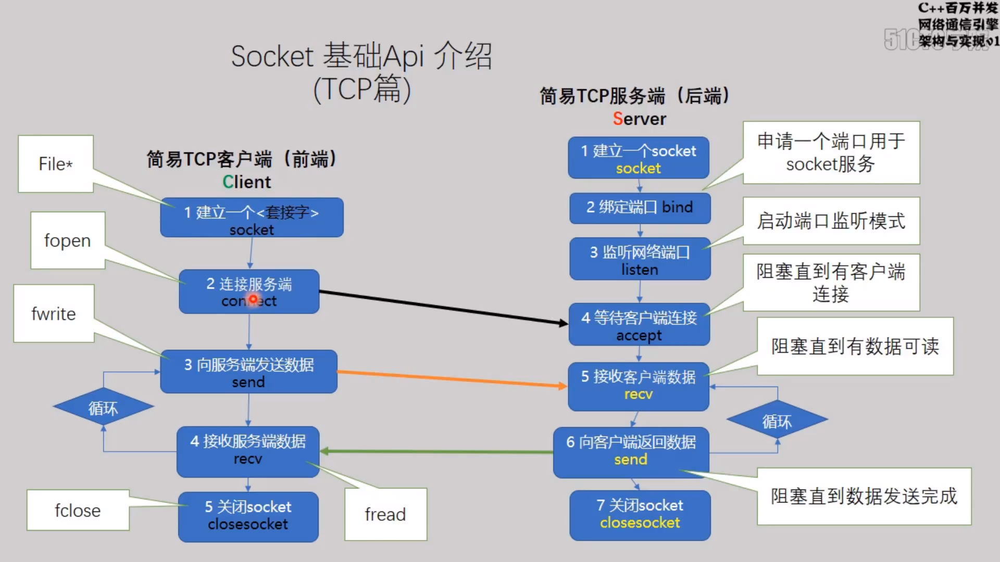
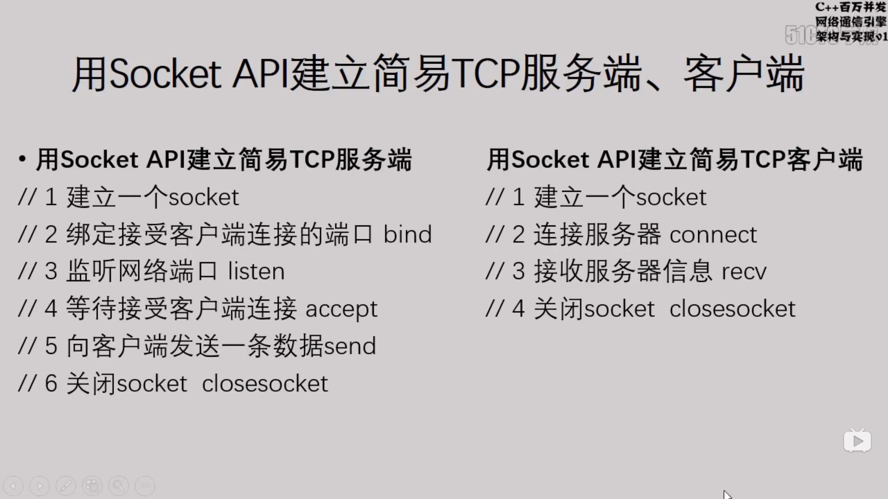

# SOket
- 示意图


## Windows 代码编写
- #define WIN32_LEAN_AND_MEAN 
    - 定义这个宏，避免冲突

-  VC 方式加载库
 - #pragma comment(lib,"ws2_32.lib")

- 其他方式
    -  在链接器-> 输入 里面加入 ws2_32.lib 


代码：
```
#define WIN32_LEAN_AND_MEAN

#include <Windows.h>
#include <WinSock2.h>
#include <iostream>

// VC 方式加载库
//#pragma comment(lib,"ws2_32.lib")


int main(void)
{
	WORD ver = MAKEWORD(2,2);
	WSADATA data;
	//启用Windows Socket 套接字
	WSAStartup(ver, &data);
	//编写WindowsSocket 代码


	WSACleanup();
	std::cout << "Hello Socket" << std::endl;
}
```
### 6步建立连接



1. connect()
    - 

```
#define WIN32_LEAN_AND_MEAN
#define _CRT_SECURE_NO_WARNINGS
#define _WINSOCK_DEPRECATED_NO_WARNINGS 


#include <Windows.h>
#include <WinSock2.h>
#include <iostream>

using std::string;
using std::cin;
using std::wcout;
using std::endl;
// VC 方式加载库
#pragma comment(lib,"ws2_32.lib")


int main(void)
{
	WORD ver = MAKEWORD(2, 2);
	WSADATA data;
	//启用Windows Socket 套接字
	WSAStartup(ver, &data);
	//编写WindowsSocket 代码
	
	//建立一个套接字
	SOCKET sock= socket(AF_INET,SOCK_STREAM,IPPROTO_TCP);
	//绑定用于接收客户端网络连接的网络端口
	sockaddr_in _sin = {};
	_sin.sin_family = AF_INET;
	// 需要转换为 网络地址 host to net unsigned 简写为 htons
	_sin.sin_port = htons(1995);
	_sin.sin_addr.S_un.S_addr = INADDR_ANY;
	//bind(sock, (sockaddr*)&_sin, sizeof(_sin));
	if (SOCKET_ERROR ==  bind(sock,(sockaddr*)&_sin,sizeof(_sin)))
	{
		//如果程序错误，抛出异常
		printf("绑定端口失败！\n");
		throw("Error");
	}
	else
	{
		printf("绑定成功！");
	}

	// listen
	try
	{
		listen(sock, 10);
	}
	catch (const std::exception&)
	{
		printf("监听失败！");

	}

	//accept 

	sockaddr_in _addr_client = {};
	int client_len = 0;
	SOCKET client_sock = INVALID_SOCKET;
	
	

	// 向客户端发送一条数据 send
	char tmp[1000]="nimei";
	while (scanf("%s",tmp))
	{
		try
		{
			SOCKET client_sock = accept(sock, (sockaddr*)&_addr_client, &client_len);
			printf("New connection is comming \t %s \n", inet_ntoa(_addr_client.sin_addr));

		}
		catch (const std::exception&)
		{
			throw("接收到了无效的Socket");
		}

		printf("%s", tmp);
		send(client_sock,tmp,sizeof(tmp)+1,0);
	}
	
	


	// 关闭套接字 
	closesocket(sock);
	closesocket(client_sock);

	WSACleanup();
	std::cout << "Hello Socket" << std::endl;
}

```