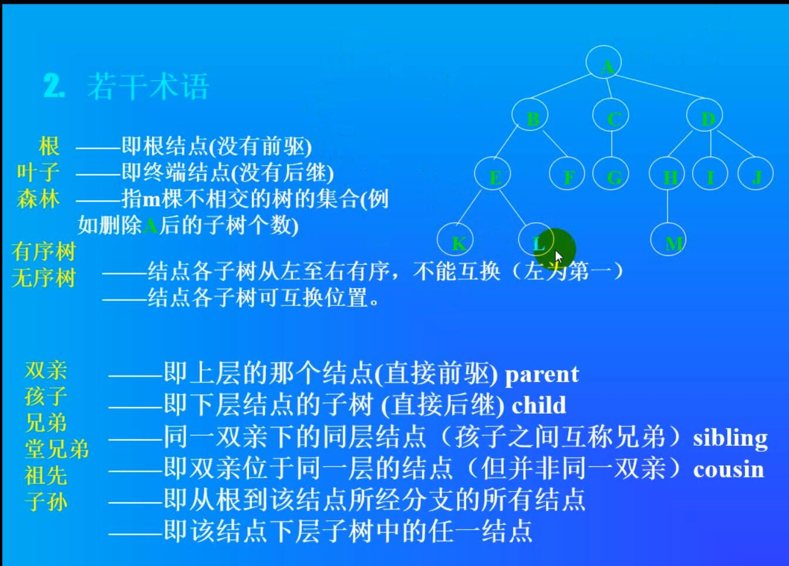

### 树与二叉树

名词解释

  
- 未完成

```
#include <iostream>


using namespace std;


class Node {
public:
	int data;
	Node* left=nullptr;
	Node* right=nullptr;
};

class tree {
public:

	Node* Head=nullptr;

	Node* tmp = Head;
	Node* seek_left_last()
	{
		if (tmp->left!= nullptr && tmp!= nullptr)
		{
			seek_left_last();
			tmp = tmp->left;
		}
		else
		{
			return tmp;
		}
	}

	Node* seek_right_last()
	{
		if (tmp != nullptr && tmp->right != nullptr)
		{
			seek_right_last();
			tmp = tmp->right;
		}
		else
		{
			return tmp;
		}
	}

	bool insert(int a)
	{
		if (Head==nullptr)
		{
			Node* x = new Node;
			x->data = a;
			Head = x;
			return true;
		}
		else
		{
			Node* x = new Node;
			x->data = a;

			
		}
	}
};


int main(void)
{
	srand(time_t(0));
	tree* tree1 = new tree;
	for (size_t i = 0; i < 100; i++)
	{
		if (i==0)
		{
			Node* n1 = new Node;
			n1->data = rand();			
			tree1->Head = n1;
			
		}
		else
		{
			

		}
		
	}


	return 0;

}
```